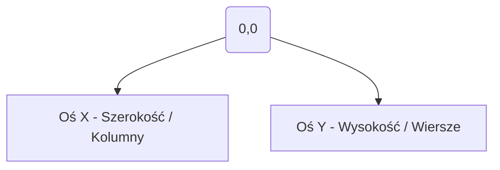
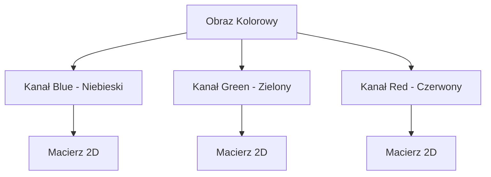

# Wykład 1: Podstawy Reprezentacji Obrazu

## Wprowadzenie

Cyfrowe przetwarzanie obrazów (Digital Image Processing) to dziedzina zajmująca się manipulacją obrazami za pomocą algorytmów komputerowych. W Pythonie najczęściej używamy do tego bibliotek **OpenCV** (do algorytmów wizji komputerowej) oraz **NumPy** (do operacji macierzowych).

## Jak komputer widzi obraz?

Dla komputera obraz to po prostu macierz (tabela) liczb. Każdy element tej macierzy to **piksel** (picture element).

### Układ współrzędnych obrazu

W przeciwieństwie do standardowego układu kartezjańskiego, w cyfrowym przetwarzaniu obrazów punkt **(0,0)** znajduje się w **lewym górnym rogu**.



### Typy obrazów

| Typ obrazu           | Opis                  | Zakres wartości                    |
| :------------------- | :-------------------- | :--------------------------------- |
| **Binarny**          | Tylko czarny i biały. | 0 (czarny), 1 lub 255 (biały)      |
| **W skali szarości** | Odcienie szarości.    | 0 (czarny) - 255 (biały)           |
| **RGB / BGR**        | Kolorowy (3 kanały).  | 0-255 dla każdego kanału (R, G, B) |

> **Ważne:** OpenCV domyślnie używa formatu **BGR** zamiast RGB!

### Diagram: Struktura obrazu RGB



## Przykłady w Pythonie

### Wczytywanie i wyświetlanie obrazu

```python
import cv2
import numpy as np

# Wczytanie obrazu w kolorze
img = cv2.imread("obrazki/bird.jpg")

# Pobranie wymiarów (wysokość, szerokość, liczba kanałów)
(h, w, c) = img.shape
print(f"Wymiary: {w}x{h}, Kanały: {c}")

# Dostęp do konkretnego piksela (y, x)
(b, g, r) = img[100, 100]
print(f"Piksel (100,100) - B: {b}, G: {g}, R: {r}")

# Wyświetlenie obrazu
cv2.imshow("Ptak", img)
cv2.waitKey(0)
cv2.destroyAllWindows()
```

### Konwersja przestrzeni barw

```python
# Konwersja na skalę szarości
gray = cv2.cvtColor(img, cv2.COLOR_BGR2GRAY)

# Konwersja na RGB (użyteczne przy wyświetlaniu w matplotlib)
rgb = cv2.cvtColor(img, cv2.COLOR_BGR2RGB)
```

## Podstawowe operacje NumPy

Ponieważ obrazy w OpenCV to tablice NumPy, możemy na nich wykonywać szybkie operacje:

- `img.shape` - zwraca krotkę (wysokość, szerokość, kanały).
- `img.dtype` - zazwyczaj `uint8` (unsigned int 8-bit, czyli 0-255).
- `roi = img[y1:y2, x1:x2]` - wycinanie fragmentu obrazu (Region of Interest).

### Przykład: Rysowanie i modyfikacja pikseli

Możemy tworzyć własne obrazy od zera za pomocą NumPy:

```python
import numpy as np
import cv2

# Tworzenie czarnego obrazu 300x300 (3 kanały BGR)
canvas = np.zeros((300, 300, 3), dtype="uint8")

# Rysowanie zielonego kwadratu w rogu
canvas[0:100, 0:100] = (0, 255, 0)

# Rysowanie czerwonej linii na środku
canvas[150, :] = (0, 0, 255)

cv2.imshow("Canvas", canvas)
cv2.waitKey(0)
```
