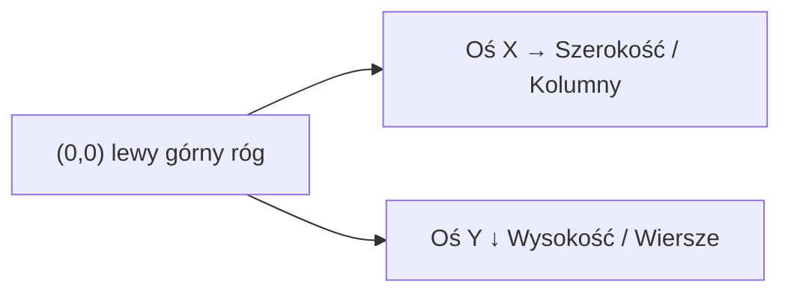
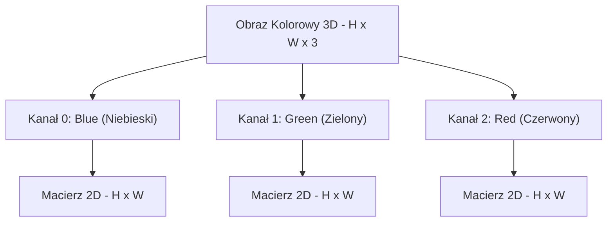
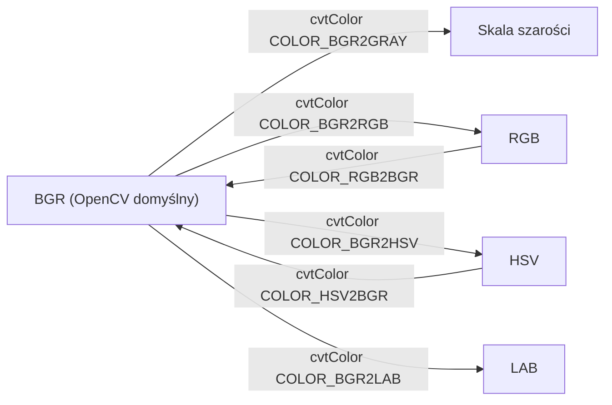
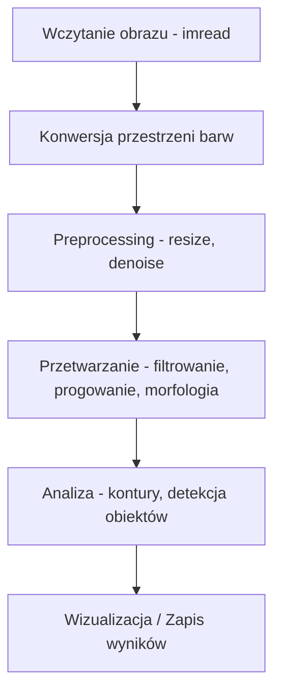

# Wykład 1: Podstawy Reprezentacji Obrazu

## Wprowadzenie

Cyfrowe przetwarzanie obrazów (Digital Image Processing) to dziedzina zajmująca się manipulacją obrazami za pomocą algorytmów komputerowych. W Pythonie najczęściej używamy do tego bibliotek **OpenCV** (do algorytmów wizji komputerowej) oraz **NumPy** (do operacji macierzowych).

### Zastosowania w praktyce

- **Medycyna** – analiza zdjęć rentgenowskich, MRI, wykrywanie nowotworów
- **Przemysł** – kontrola jakości produktów na taśmie produkcyjnej
- **Motoryzacja** – systemy ADAS (wykrywanie pieszych, znaków drogowych)
- **Bezpieczeństwo** – rozpoznawanie twarzy, analiza nagrań CCTV
- **Rolnictwo** – analiza satelitarna upraw, wykrywanie chorób roślin

______________________________________________________________________

## Jak komputer widzi obraz?

Dla komputera obraz to po prostu macierz (tabela) liczb. Każdy element tej macierzy to **piksel** (picture element).

### Układ współrzędnych obrazu

W przeciwieństwie do standardowego układu kartezjańskiego, w cyfrowym przetwarzaniu obrazów punkt **(0,0)** znajduje się w **lewym górnym rogu**.

```
(0,0) ──────────────────► X (kolumny / szerokość)
  │
  │    piksel(row, col)
  │    czyli img[y, x]
  │
  ▼
  Y (wiersze / wysokość)
```



> **Uwaga:** W NumPy dostęp do piksela to `img[wiersz, kolumna]`, czyli `img[y, x]` — odwrotnie niż w matematyce!

______________________________________________________________________

## Typy obrazów

| Typ obrazu           | Opis                          | Zakres wartości              | Kanały |
| :------------------- | :---------------------------- | :--------------------------- | :----- |
| **Binarny**          | Tylko czarny i biały.         | 0 (czarny), 255 (biały)      | 1      |
| **W skali szarości** | Odcienie szarości.            | 0 (czarny) – 255 (biały)     | 1      |
| **RGB / BGR**        | Kolorowy.                     | 0–255 dla każdego kanału     | 3      |
| **RGBA / BGRA**      | Kolorowy z przezroczystością. | 0–255 + kanał Alpha          | 4      |
| **HSV**              | Barwa, nasycenie, jasność.    | H: 0–179, S: 0–255, V: 0–255 | 3      |

> **Ważne:** OpenCV domyślnie używa formatu **BGR** zamiast RGB!

### Diagram: Struktura obrazu RGB



### Diagram: Przestrzenie barw i konwersje



______________________________________________________________________

## Głębia bitowa i typy danych

Głębia bitowa określa, ile wartości może przyjąć jeden piksel:

| Typ NumPy | Zakres    | Zastosowanie                          |
| :-------- | :-------- | :------------------------------------ |
| `uint8`   | 0 – 255   | Standardowe obrazy (najczęstszy)      |
| `uint16`  | 0 – 65535 | Obrazy medyczne, RAW z aparatów       |
| `float32` | 0.0 – 1.0 | Obliczenia pośrednie, sieci neuronowe |
| `float64` | 0.0 – 1.0 | Wysokoprecyzyjne obliczenia           |

```python
import cv2
import numpy as np

img = cv2.imread("obrazki/bird.jpg")
print(f"Typ danych: {img.dtype}")  # uint8
print(f"Kształt: {img.shape}")  # (wysokość, szerokość, kanały)
print(f"Min: {img.min()}, Max: {img.max()}")

# Konwersja na float32 (wartości 0.0 - 1.0)
img_float = img.astype(np.float32) / 255.0
```

______________________________________________________________________

## Przykłady w Pythonie

### Wczytywanie i wyświetlanie obrazu

```python
import cv2
import numpy as np

# Wczytanie obrazu w kolorze (domyślnie BGR)
img = cv2.imread("obrazki/bird.jpg")

# Wczytanie w skali szarości
gray = cv2.imread("obrazki/bird.jpg", cv2.IMREAD_GRAYSCALE)
# lub: gray = cv2.imread("obrazki/bird.jpg", 0)

# Pobranie wymiarów (wysokość, szerokość, liczba kanałów)
(h, w, c) = img.shape
print(f"Wymiary: {w}x{h}, Kanały: {c}")

# Dostęp do konkretnego piksela (y, x) → (wiersz, kolumna)
(b, g, r) = img[100, 100]
print(f"Piksel (100,100) - B: {b}, G: {g}, R: {r}")

# Wyświetlenie obrazu
cv2.imshow("Ptak", img)
cv2.waitKey(0)
cv2.destroyAllWindows()
```

### Konwersja przestrzeni barw

```python
# Konwersja na skalę szarości
gray = cv2.cvtColor(img, cv2.COLOR_BGR2GRAY)

# Konwersja na RGB (użyteczne przy wyświetlaniu w matplotlib)
rgb = cv2.cvtColor(img, cv2.COLOR_BGR2RGB)

# Konwersja na HSV (przydatne do śledzenia kolorów)
hsv = cv2.cvtColor(img, cv2.COLOR_BGR2HSV)

# Wyświetlenie wszystkich wersji
import matplotlib.pyplot as plt

fig, axes = plt.subplots(1, 3, figsize=(15, 5))
axes[0].imshow(rgb)
axes[0].set_title("RGB")
axes[1].imshow(gray, cmap="gray")
axes[1].set_title("Skala szarości")
axes[2].imshow(hsv)
axes[2].set_title("HSV")
plt.show()
```

### Rozdzielanie i łączenie kanałów

```python
# Rozdzielenie na kanały B, G, R
b, g, r = cv2.split(img)

# Wyświetlenie pojedynczego kanału
cv2.imshow("Kanał czerwony", r)

# Tworzenie obrazu tylko z kanałem czerwonym (pozostałe = 0)
zeros = np.zeros_like(r)
red_only = cv2.merge([zeros, zeros, r])
cv2.imshow("Tylko czerwony", red_only)

# Scalenie kanałów z powrotem
merged = cv2.merge([b, g, r])

cv2.waitKey(0)
cv2.destroyAllWindows()
```

______________________________________________________________________

## Podstawowe operacje NumPy na obrazach

Ponieważ obrazy w OpenCV to tablice NumPy, możemy na nich wykonywać szybkie operacje:

| Operacja           | Kod                            | Opis                                |
| :----------------- | :----------------------------- | :---------------------------------- |
| Kształt obrazu     | `img.shape`                    | Krotka (H, W) lub (H, W, C)         |
| Typ danych         | `img.dtype`                    | Zazwyczaj `uint8`                   |
| Wycinek (ROI)      | `roi = img[y1:y2, x1:x2]`      | Region of Interest                  |
| Kopiowanie         | `img2 = img.copy()`            | Głęboka kopia (nie referencja!)     |
| Odwrócenie kolorów | `inv = 255 - img`              | Negatyw obrazu                      |
| Rozjaśnienie       | `bright = cv2.add(img, 50)`    | Bezpieczne dodawanie (bez overflow) |
| Przyciemnienie     | `dark = cv2.subtract(img, 50)` | Bezpieczne odejmowanie              |

### Przykład: Tworzenie obrazu od zera i rysowanie

```python
import numpy as np
import cv2

# Tworzenie czarnego obrazu 400x600 (3 kanały BGR)
canvas = np.zeros((400, 600, 3), dtype="uint8")

# Rysowanie wypełnionego prostokąta (zielony)
cv2.rectangle(canvas, (50, 50), (200, 150), (0, 255, 0), -1)

# Rysowanie okręgu (niebieski, grubość 3px)
cv2.circle(canvas, (350, 200), 80, (255, 0, 0), 3)

# Rysowanie linii (czerwona)
cv2.line(canvas, (0, 300), (600, 300), (0, 0, 255), 2)

# Dodanie tekstu
cv2.putText(
    canvas, "OpenCV!", (200, 370), cv2.FONT_HERSHEY_SIMPLEX, 1.5, (255, 255, 255), 2
)

cv2.imshow("Canvas", canvas)
cv2.waitKey(0)
cv2.destroyAllWindows()
```

### Przykład: Region of Interest (ROI) – kopiowanie fragmentu

```python
img = cv2.imread("obrazki/bird.jpg")

# Wycięcie fragmentu (ROI) – np. górna lewa ćwiartka
roi = img[0 : img.shape[0] // 2, 0 : img.shape[1] // 2]

# Wklejenie ROI w inne miejsce
img[img.shape[0] // 2 :, img.shape[1] // 2 :] = roi

cv2.imshow("ROI skopiowany", img)
cv2.waitKey(0)
cv2.destroyAllWindows()
```

______________________________________________________________________

## Zapis obrazu do pliku

```python
# Zapis jako JPEG (kompresja stratna, jakość 0-100)
cv2.imwrite("wynik.jpg", img, [cv2.IMWRITE_JPEG_QUALITY, 95])

# Zapis jako PNG (kompresja bezstratna)
cv2.imwrite("wynik.png", img)

# Zapis skali szarości
cv2.imwrite("szary.png", gray)
```

______________________________________________________________________

## Diagram: Typowy przepływ pracy z obrazem



______________________________________________________________________

## Ćwiczenia praktyczne

1. Wczytaj dowolny obraz i wyświetl jego wymiary, typ danych oraz wartość piksela w środku obrazu.
1. Rozdziel obraz na kanały BGR i wyświetl każdy kanał osobno w skali szarości.
1. Stwórz obraz 500×500 i narysuj na nim flagę Polski (biały i czerwony prostokąt).
1. Wczytaj obraz, wytnij jego środkowy fragment (ROI) i zapisz go jako osobny plik PNG.
1. Stwórz negatyw obrazu (`255 - img`) i porównaj z oryginałem.
