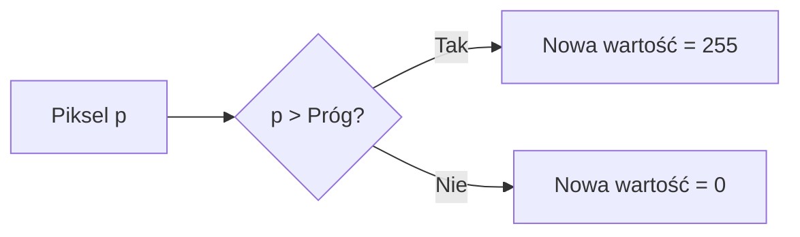
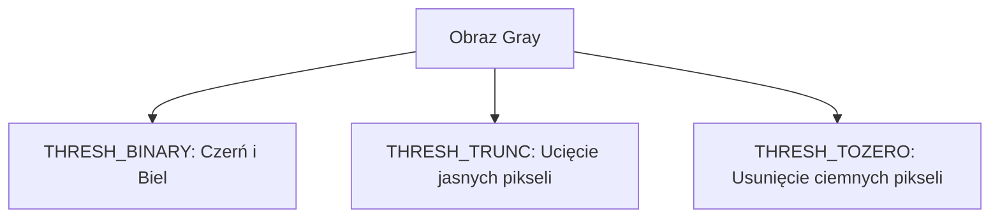

# Wykład 2: Progowanie (Thresholding)

## Co to jest progowanie?

Progowanie (thresholding) to najprostsza metoda **segmentacji obrazu**. Pozwala ona wyodrębnić obiekty z tła poprzez zamianę obrazu w skali szarości na obraz binarny (czarno-biały).

### Główna idea

Jeśli jasność piksela jest większa od pewnej wartości (progu), przypisujemy mu nową wartość (zazwyczaj biały), w przeciwnym razie czarny.

### Rodzaje progowania

| Metoda                | Opis                                                  | Kiedy stosować?                                |
| :-------------------- | :---------------------------------------------------- | :--------------------------------------------- |
| **Proste (Globalne)** | Ten sam próg dla całego obrazu.                       | Równomierne oświetlenie.                       |
| **Adaptacyjne**       | Próg wyliczany lokalnie dla małych fragmentów obrazu. | Nierównomierne oświetlenie (np. cień).         |
| **Metoda Otsu**       | Automatyczne znalezienie optymalnego progu.           | Wyraźne dwa piki w histogramie (tło i obiekt). |

## Przykład w Pythonie

### Progowanie globalne

```python
import cv2

# Wczytanie w skali szarości
img = cv2.imread("obrazki/bird.jpg", cv2.IMREAD_GRAYSCALE)

# cv2.threshold(src, thresh, maxval, type)
# T = 127, MaxValue = 255
(T, thresh) = cv2.threshold(img, 127, 255, cv2.THRESH_BINARY)

cv2.imshow("Original", img)
cv2.imshow("Binary", thresh)
cv2.waitKey(0)
```

### Progowanie adaptacyjne

```python
# cv2.adaptiveThreshold(src, maxValue, adaptiveMethod, thresholdType, blockSize, C)
thresh_adapt = cv2.adaptiveThreshold(
    img, 255, cv2.ADAPTIVE_THRESH_GAUSSIAN_C, cv2.THRESH_BINARY_INV, 11, 2
)
```

### Metoda Otsu (Automatyczny próg)

Metoda Otsu analizuje histogram obrazu i wybiera próg, który minimalizuje wariancję wewnątrzklasową.

```python
# Dodajemy flagę cv2.THRESH_OTSU do typu progowania
# Próg (127) jest ignorowany, OpenCV wylicza go sam
(T, thresh_otsu) = cv2.threshold(img, 0, 255, cv2.THRESH_BINARY + cv2.THRESH_OTSU)
print(f"Wyliczony próg Otsu: {T}")
```

## Schemat działania progowania binarnego



### Porównanie wizualne typów progowania



## Typy progowania w OpenCV

- `cv2.THRESH_BINARY`: `dst(x,y) = maxval if src(x,y) > thresh else 0`
- `cv2.THRESH_BINARY_INV`: `dst(x,y) = 0 if src(x,y) > thresh else maxval`
- `cv2.THRESH_TRUNC`: `dst(x,y) = thresh if src(x,y) > thresh else src(x,y)`
- `cv2.THRESH_TOZERO`: `dst(x,y) = src(x,y) if src(x,y) > thresh else 0`
- `cv2.THRESH_TOZERO_INV`: `dst(x,y) = 0 if src(x,y) > thresh else src(x,y)`
