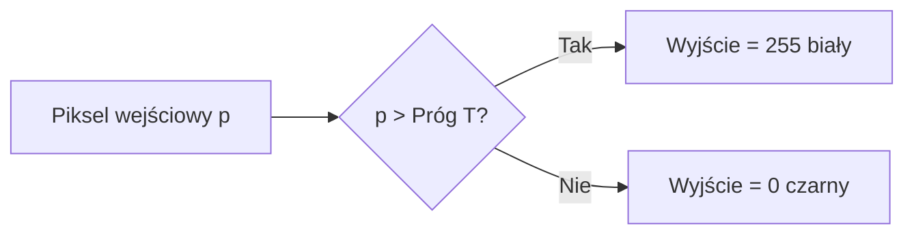
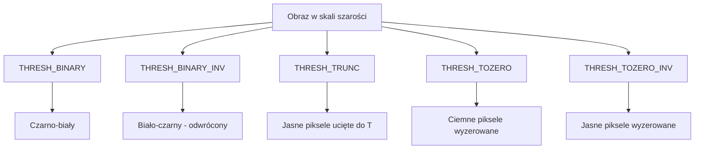
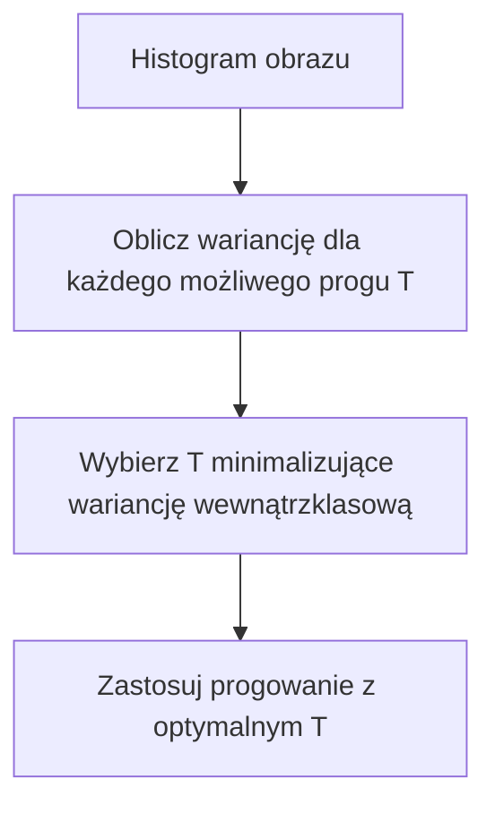
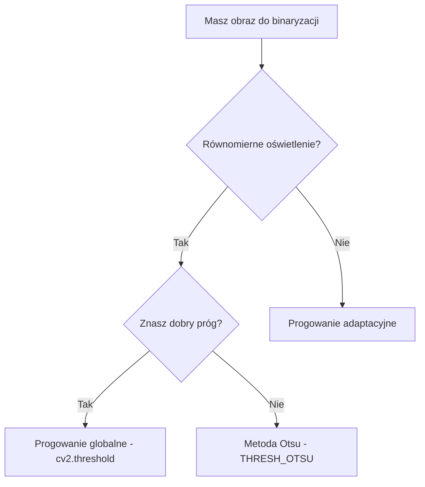

# Wykład 2: Progowanie (Thresholding)

## Co to jest progowanie?

Progowanie (thresholding) to najprostsza metoda **segmentacji obrazu**. Pozwala wyodrębnić obiekty z tła poprzez zamianę obrazu w skali szarości na obraz binarny (czarno-biały).

### Główna idea

Jeśli jasność piksela jest większa od pewnej wartości (progu T), przypisujemy mu wartość 255 (biały), w przeciwnym razie 0 (czarny).

```
pixel_out = 255  jeśli pixel_in > T
pixel_out = 0    jeśli pixel_in <= T
```

### Kiedy stosować progowanie?

- Oddzielenie tekstu od tła dokumentu
- Wykrywanie obiektów na jednolitym tle
- Przygotowanie obrazu do analizy konturów
- Segmentacja komórek w obrazach medycznych

______________________________________________________________________

## Rodzaje progowania

| Metoda                | Opis                                                  | Kiedy stosować?                               |
| :-------------------- | :---------------------------------------------------- | :-------------------------------------------- |
| **Proste (Globalne)** | Ten sam próg dla całego obrazu.                       | Równomierne oświetlenie.                      |
| **Adaptacyjne**       | Próg wyliczany lokalnie dla małych fragmentów obrazu. | Nierównomierne oświetlenie (np. cień, tekst). |
| **Metoda Otsu**       | Automatyczne znalezienie optymalnego progu.           | Wyraźne dwa piki w histogramie (bimodalne).   |

______________________________________________________________________

## Typy progowania w OpenCV

| Flaga               | Formuła               | Efekt                            |
| :------------------ | :-------------------- | :------------------------------- |
| `THRESH_BINARY`     | `255 if p > T else 0` | Klasyczna binaryzacja            |
| `THRESH_BINARY_INV` | `0 if p > T else 255` | Odwrócona binaryzacja            |
| `THRESH_TRUNC`      | `T if p > T else p`   | Ucięcie jasnych pikseli do progu |
| `THRESH_TOZERO`     | `p if p > T else 0`   | Zerowanie ciemnych pikseli       |
| `THRESH_TOZERO_INV` | `0 if p > T else p`   | Zerowanie jasnych pikseli        |

### Diagram: Schemat działania progowania binarnego



### Diagram: Porównanie wszystkich typów



______________________________________________________________________

## Przykłady w Pythonie

### Progowanie globalne – wszystkie typy

```python
import cv2
import matplotlib.pyplot as plt

img = cv2.imread("obrazki/bird.jpg", cv2.IMREAD_GRAYSCALE)

typy = [
    ("BINARY", cv2.THRESH_BINARY),
    ("BINARY_INV", cv2.THRESH_BINARY_INV),
    ("TRUNC", cv2.THRESH_TRUNC),
    ("TOZERO", cv2.THRESH_TOZERO),
    ("TOZERO_INV", cv2.THRESH_TOZERO_INV),
]

fig, axes = plt.subplots(2, 3, figsize=(15, 10))
axes[0, 0].imshow(img, cmap="gray")
axes[0, 0].set_title("Oryginał")

for i, (nazwa, typ) in enumerate(typy):
    (T, wynik) = cv2.threshold(img, 127, 255, typ)
    ax = axes[(i + 1) // 3, (i + 1) % 3]
    ax.imshow(wynik, cmap="gray")
    ax.set_title(nazwa)

plt.tight_layout()
plt.show()
```

### Metoda Otsu – automatyczny próg

Metoda Otsu analizuje histogram i wybiera próg minimalizujący wariancję wewnątrzklasową (między pikselami tła i obiektu).



```python
import cv2

img = cv2.imread("obrazki/bird.jpg", cv2.IMREAD_GRAYSCALE)

# Otsu – próg 0 jest ignorowany, OpenCV wylicza go automatycznie
(T, thresh_otsu) = cv2.threshold(img, 0, 255, cv2.THRESH_BINARY + cv2.THRESH_OTSU)
print(f"Optymalny próg Otsu: {T}")

# Często stosuje się Otsu po rozmyciu Gaussowskim (lepsze wyniki)
import cv2

blurred = cv2.GaussianBlur(img, (5, 5), 0)
(T2, thresh_otsu2) = cv2.threshold(blurred, 0, 255, cv2.THRESH_BINARY + cv2.THRESH_OTSU)
print(f"Próg Otsu po Gaussie: {T2}")
```

### Progowanie adaptacyjne

Zamiast jednego progu dla całego obrazu, próg jest wyliczany **lokalnie** dla każdego małego obszaru (bloku pikseli).

```python
import cv2

img = cv2.imread("obrazki/male/eurotext.png", cv2.IMREAD_GRAYSCALE)

# Metoda Mean – próg = średnia wartość w bloku - C
thresh_mean = cv2.adaptiveThreshold(
    img,
    255,
    cv2.ADAPTIVE_THRESH_MEAN_C,
    cv2.THRESH_BINARY,
    blockSize=11,  # rozmiar bloku (musi być nieparzysty)
    C=2,  # stała odejmowana od średniej
)

# Metoda Gaussian – próg = ważona średnia Gaussowska w bloku - C
thresh_gauss = cv2.adaptiveThreshold(
    img, 255, cv2.ADAPTIVE_THRESH_GAUSSIAN_C, cv2.THRESH_BINARY, blockSize=11, C=2
)

cv2.imshow("Mean", thresh_mean)
cv2.imshow("Gaussian", thresh_gauss)
cv2.waitKey(0)
cv2.destroyAllWindows()
```

**Parametry adaptiveThreshold:**

- `blockSize` – rozmiar sąsiedztwa (np. 11 = blok 11×11 pikseli), musi być nieparzysty
- `C` – stała odejmowana od wyliczonego progu (reguluje czułość)

### Porównanie: globalne vs adaptacyjne

```python
import cv2
import matplotlib.pyplot as plt

img = cv2.imread("obrazki/male/eurotext.png", cv2.IMREAD_GRAYSCALE)

_, global_thresh = cv2.threshold(img, 127, 255, cv2.THRESH_BINARY)
_, otsu_thresh = cv2.threshold(img, 0, 255, cv2.THRESH_BINARY + cv2.THRESH_OTSU)
adapt_thresh = cv2.adaptiveThreshold(
    img, 255, cv2.ADAPTIVE_THRESH_GAUSSIAN_C, cv2.THRESH_BINARY, 11, 2
)

fig, axes = plt.subplots(1, 4, figsize=(20, 5))
for ax, obraz, tytul in zip(
    axes,
    [img, global_thresh, otsu_thresh, adapt_thresh],
    ["Oryginał", "Globalne T=127", "Otsu", "Adaptacyjne Gauss"],
):
    ax.imshow(obraz, cmap="gray")
    ax.set_title(tytul)
    ax.axis("off")
plt.tight_layout()
plt.show()
```

______________________________________________________________________

## Interaktywny dobór progu z Trackbarem

```python
import cv2
import numpy as np

img = cv2.imread("obrazki/bird.jpg", cv2.IMREAD_GRAYSCALE)


def aktualizuj(val):
    T = cv2.getTrackbarPos("Próg", "Progowanie")
    _, thresh = cv2.threshold(img, T, 255, cv2.THRESH_BINARY)
    cv2.imshow("Progowanie", thresh)


cv2.namedWindow("Progowanie")
cv2.createTrackbar("Próg", "Progowanie", 127, 255, aktualizuj)
aktualizuj(0)

cv2.waitKey(0)
cv2.destroyAllWindows()
```

______________________________________________________________________

## Diagram: Wybór metody progowania



______________________________________________________________________

## Typowe błędy i jak ich unikać

| Problem                              | Przyczyna                      | Rozwiązanie                               |
| :----------------------------------- | :----------------------------- | :---------------------------------------- |
| Obraz nie jest binarny               | Wczytano jako BGR zamiast GRAY | Dodaj `cv2.IMREAD_GRAYSCALE`              |
| Zły wynik przy nierównym oświetleniu | Użyto progu globalnego         | Użyj `adaptiveThreshold`                  |
| Dużo szumu w wyniku                  | Brak preprocessingu            | Zastosuj `GaussianBlur` przed progowaniem |
| Otsu daje zły próg                   | Histogram nie jest bimodalny   | Spróbuj progowania adaptacyjnego          |

______________________________________________________________________

## Ćwiczenia praktyczne

1. Wczytaj obraz `eurotext.png` i porównaj wyniki progowania globalnego (T=127), Otsu i adaptacyjnego.
1. Napisz program z trackbarem, który pozwala interaktywnie zmieniać próg i typ progowania.
1. Zastosuj rozmycie Gaussowskie przed metodą Otsu i sprawdź, czy próg się zmienia.
1. Spróbuj zbinaryzować obraz z nierównym oświetleniem – porównaj globalne vs adaptacyjne.
1. Użyj `THRESH_BINARY_INV` na obrazie tekstu – kiedy jest to przydatne?
