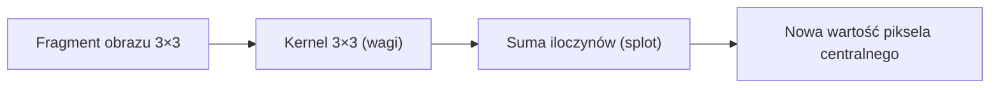
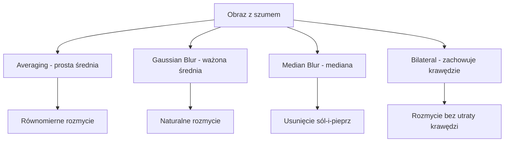
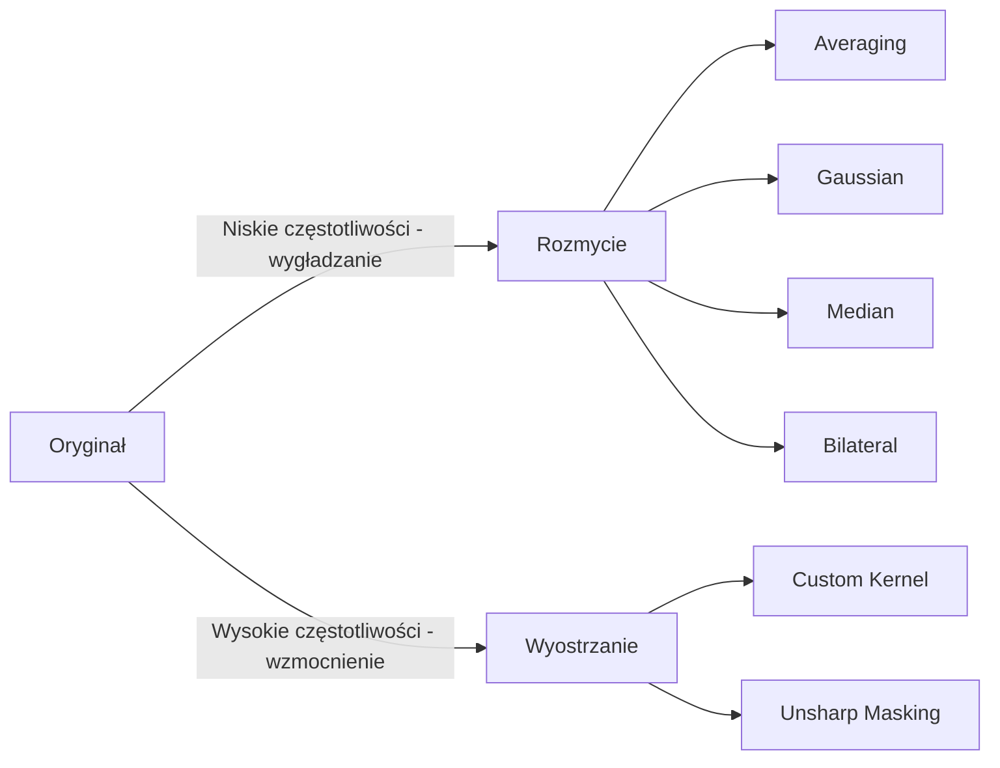
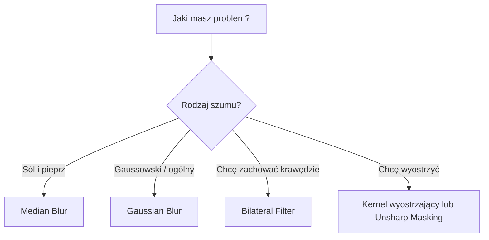

# Wykład 3: Filtrowanie – Rozmycie i Wyostrzanie

## Filtrowanie obrazów

Filtrowanie to operacja, która modyfikuje wartość piksela na podstawie wartości jego sąsiadów. Wykorzystuje do tego celu tzw. **jądro (kernel)** lub **maskę konwolucyjną**.

### Zastosowania filtrowania

- **Redukcja szumu** – usuwanie zakłóceń przed dalszym przetwarzaniem
- **Wyostrzanie** – uwydatnianie szczegółów i krawędzi
- **Detekcja krawędzi** – podstawa algorytmów Sobel, Canny
- **Preprocessing** – przygotowanie obrazu do segmentacji lub OCR

______________________________________________________________________

## Jak działa kernel (Splot / Konwolucja)?

Kernel to mała macierz (np. 3×3 lub 5×5), którą "przesuwamy" nad obrazem. Nowa wartość piksela centralnego to **suma iloczynów** wartości sąsiednich pikseli przez odpowiadające im wagi z kernela.

```
Obraz (fragment):        Kernel 3×3:         Wynik:
┌───┬───┬───┐           ┌───┬───┬───┐
│ a │ b │ c │           │ k1│ k2│ k3│        nowy_piksel =
├───┼───┼───┤     ⊗     ├───┼───┼───┤        a*k1 + b*k2 + c*k3 +
│ d │ e │ f │           │ k4│ k5│ k6│        d*k4 + e*k5 + f*k6 +
├───┼───┼───┤           ├───┼───┼───┤        g*k7 + h*k8 + i*k9
│ g │ h │ i │           │ k7│ k8│ k9│
└───┴───┴───┘           └───┴───┴───┘
```

**Przykład kernela uśredniającego (Box Filter) 3×3:**

```
[ 1/9  1/9  1/9 ]
[ 1/9  1/9  1/9 ]
[ 1/9  1/9  1/9 ]
```

Każdy piksel zastępowany jest średnią arytmetyczną z 9 sąsiadów → efekt rozmycia.



______________________________________________________________________

## 1. Rozmycie (Wygładzanie / Blurring)

Głównym celem jest **redukcja szumu** lub ukrycie drobnych szczegółów.

| Metoda               | Funkcja OpenCV        | Opis                                                  | Najlepszy na        |
| :------------------- | :-------------------- | :---------------------------------------------------- | :------------------ |
| **Averaging**        | `cv2.blur`            | Prosta średnia arytmetyczna z otoczenia.              | Ogólne rozmycie     |
| **Gaussian Blur**    | `cv2.GaussianBlur`    | Średnia ważona rozkładem Gaussa (bardziej naturalne). | Szum Gaussowski     |
| **Median Blur**      | `cv2.medianBlur`      | Zastępuje piksel medianą sąsiadów.                    | Szum "sól i pieprz" |
| **Bilateral Filter** | `cv2.bilateralFilter` | Wygładza, ale **zachowuje krawędzie**.                | Wygładzanie z HDR   |

### Diagram: Porównanie metod rozmycia



### Przykłady w Pythonie

```python
import cv2
import matplotlib.pyplot as plt

img = cv2.imread("obrazki/bird.jpg")

# 1. Averaging (Box Filter) – prosta średnia
avg = cv2.blur(img, (5, 5))

# 2. Gaussian Blur – ważona średnia Gaussowska
# (ksize musi być nieparzysty, 0 = sigma wyliczana automatycznie)
gauss = cv2.GaussianBlur(img, (5, 5), 0)

# 3. Median Blur – mediana (ksize musi być nieparzysty)
median = cv2.medianBlur(img, 5)

# 4. Bilateral Filter – zachowuje krawędzie
# (d=9, sigmaColor=75, sigmaSpace=75)
bilateral = cv2.bilateralFilter(img, 9, 75, 75)

# Wizualizacja
fig, axes = plt.subplots(1, 5, figsize=(25, 5))
for ax, obraz, tytul in zip(
    axes,
    [img, avg, gauss, median, bilateral],
    ["Oryginał", "Averaging", "Gaussian", "Median", "Bilateral"],
):
    ax.imshow(cv2.cvtColor(obraz, cv2.COLOR_BGR2RGB))
    ax.set_title(tytul)
    ax.axis("off")
plt.tight_layout()
plt.show()
```

### Wpływ rozmiaru kernela

Im większy kernel, tym silniejsze rozmycie:

```python
import cv2
import matplotlib.pyplot as plt

img = cv2.imread("obrazki/bird.jpg")

rozmiary = [3, 7, 15, 31]
fig, axes = plt.subplots(1, len(rozmiary) + 1, figsize=(20, 4))
axes[0].imshow(cv2.cvtColor(img, cv2.COLOR_BGR2RGB))
axes[0].set_title("Oryginał")

for i, k in enumerate(rozmiary):
    blurred = cv2.GaussianBlur(img, (k, k), 0)
    axes[i + 1].imshow(cv2.cvtColor(blurred, cv2.COLOR_BGR2RGB))
    axes[i + 1].set_title(f"Gauss {k}×{k}")

plt.tight_layout()
plt.show()
```

### Szum "sól i pieprz" – dlaczego Median jest lepszy?

```python
import cv2
import numpy as np

img = cv2.imread("obrazki/bird.jpg", cv2.IMREAD_GRAYSCALE)

# Dodanie szumu "sól i pieprz"
noise = img.copy()
num_pixels = int(0.05 * img.size)  # 5% pikseli
coords = [np.random.randint(0, i, num_pixels) for i in img.shape]
noise[coords[0], coords[1]] = 255  # sól (białe)
coords = [np.random.randint(0, i, num_pixels) for i in img.shape]
noise[coords[0], coords[1]] = 0  # pieprz (czarne)

# Porównanie filtrów
gauss_result = cv2.GaussianBlur(noise, (5, 5), 0)
median_result = cv2.medianBlur(noise, 5)

# Median znacznie lepiej usuwa szum sól-i-pieprz!
```

______________________________________________________________________

## 2. Wyostrzanie (Sharpening)

Wyostrzanie polega na **wzmocnieniu różnic** między sąsiednimi pikselami (wysokich częstotliwości).

### Kernele wyostrzające

```python
import numpy as np
import cv2

img = cv2.imread("obrazki/bird.jpg")

# Kernel wyostrzający podstawowy
kernel_sharp = np.array([[0, -1, 0], [-1, 5, -1], [0, -1, 0]], dtype=np.float32)

# Kernel wyostrzający mocniejszy (wszystkie sąsiedzi)
kernel_sharp2 = np.array([[-1, -1, -1], [-1, 9, -1], [-1, -1, -1]], dtype=np.float32)

sharpened = cv2.filter2D(img, -1, kernel_sharp)
sharpened2 = cv2.filter2D(img, -1, kernel_sharp2)
```

> **Zasada:** Suma wag kernela wyostrzającego = 1 (zachowanie jasności). Piksel centralny ma wagę > 1, sąsiedzi mają wagi ujemne.

### Unsharp Masking

Technika wyostrzania przez odjęcie rozmytej wersji od oryginału:

```
wyostrzony = oryginał + α * (oryginał - rozmyty)
           = (1+α) * oryginał - α * rozmyty
```

```python
import cv2

img = cv2.imread("obrazki/bird.jpg")

# Rozmycie Gaussowskie
blurred = cv2.GaussianBlur(img, (0, 0), 2.0)

# Unsharp Masking: 1.5 * oryginał - 0.5 * rozmyty
unsharp = cv2.addWeighted(img, 1.5, blurred, -0.5, 0)

cv2.imshow("Oryginał", img)
cv2.imshow("Unsharp Masking", unsharp)
cv2.waitKey(0)
cv2.destroyAllWindows()
```

______________________________________________________________________

## 3. Własne kernele – cv2.filter2D

Funkcja `cv2.filter2D` pozwala zastosować **dowolny kernel** do obrazu:

```python
import cv2
import numpy as np

img = cv2.imread("obrazki/bird.jpg")

# Kernel emboss (efekt reliefu)
kernel_emboss = np.array([[-2, -1, 0], [-1, 1, 1], [0, 1, 2]], dtype=np.float32)

# Kernel wykrywania krawędzi poziomych
kernel_edges_h = np.array([[-1, -1, -1], [0, 0, 0], [1, 1, 1]], dtype=np.float32)

# Kernel wykrywania krawędzi pionowych
kernel_edges_v = np.array([[-1, 0, 1], [-1, 0, 1], [-1, 0, 1]], dtype=np.float32)

emboss = cv2.filter2D(img, -1, kernel_emboss)
edges_h = cv2.filter2D(img, -1, kernel_edges_h)
edges_v = cv2.filter2D(img, -1, kernel_edges_v)
```

### Tabela popularnych kerneli

| Nazwa       | Kernel (3×3)                                | Efekt                |
| :---------- | :------------------------------------------ | :------------------- |
| Box Filter  | Wszystkie wagi = 1/9                        | Rozmycie równomierne |
| Wyostrzanie | Środek=5, sąsiedzi=-1 (góra/dół/lewo/prawo) | Wyostrzenie krawędzi |
| Sobel X     | Kolumny: -1,0,+1 z wagami Gaussa            | Krawędzie pionowe    |
| Sobel Y     | Wiersze: -1,0,+1 z wagami Gaussa            | Krawędzie poziome    |
| Laplacian   | Środek=4 lub 8, sąsiedzi=-1                 | Wszystkie krawędzie  |
| Emboss      | Przekątna ujemna/dodatnia                   | Efekt reliefu 3D     |

______________________________________________________________________

## Diagram: Filtrowanie – Rozmycie vs Wyostrzanie



## Diagram: Wybór filtra



______________________________________________________________________

## Interaktywne rozmycie z Trackbarem

```python
import cv2
import numpy as np

img = cv2.imread("obrazki/bird.jpg")


def aktualizuj(val):
    k = cv2.getTrackbarPos("Kernel", "Blur")
    if k % 2 == 0:
        k += 1  # kernel musi być nieparzysty
    k = max(1, k)
    blurred = cv2.GaussianBlur(img, (k, k), 0)
    cv2.imshow("Blur", blurred)


cv2.namedWindow("Blur")
cv2.createTrackbar("Kernel", "Blur", 1, 51, aktualizuj)
aktualizuj(0)

cv2.waitKey(0)
cv2.destroyAllWindows()
```

______________________________________________________________________

## Typowe błędy i jak ich unikać

| Problem                      | Przyczyna                            | Rozwiązanie                              |
| :--------------------------- | :----------------------------------- | :--------------------------------------- |
| Błąd przy parzystym kernelu  | Gaussian/Median wymaga nieparzystego | Zawsze używaj 3, 5, 7, 9, ...            |
| Rozmycie nie usuwa szumu     | Zły typ filtra dla danego szumu      | Dla sól-i-pieprz użyj Median             |
| Wyostrzanie tworzy artefakty | Zbyt agresywny kernel                | Zmniejsz wagi lub użyj Unsharp Masking   |
| Bilateral bardzo wolny       | Duże d i sigma                       | Zmniejsz parametr `d` (np. 5 zamiast 15) |

______________________________________________________________________

## Ćwiczenia praktyczne

1. Porównaj wszystkie 4 metody rozmycia na tym samym obrazie – która daje najlepszy efekt wizualny?
1. Dodaj szum "sól i pieprz" do obrazu i sprawdź, który filtr najlepiej go usuwa.
1. Stwórz własny kernel 5×5 wyostrzający i zastosuj go za pomocą `cv2.filter2D`.
1. Zaimplementuj Unsharp Masking z różnymi wartościami alpha (0.5, 1.0, 2.0) i porównaj wyniki.
1. Napisz program z trackbarem do interaktywnego doboru rozmiaru kernela Gaussowskiego.
1. Zastosuj `bilateralFilter` na portrecie – czy krawędzie twarzy są zachowane?
