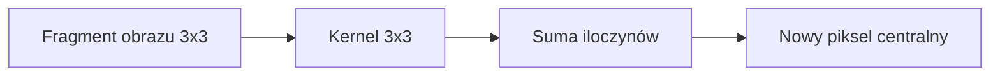
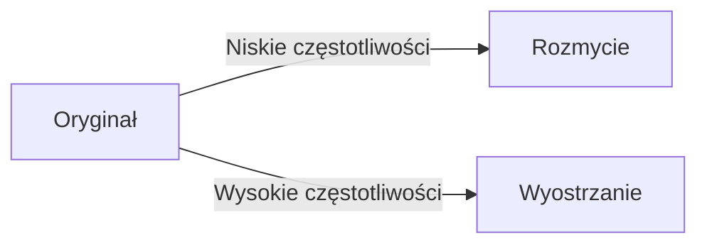
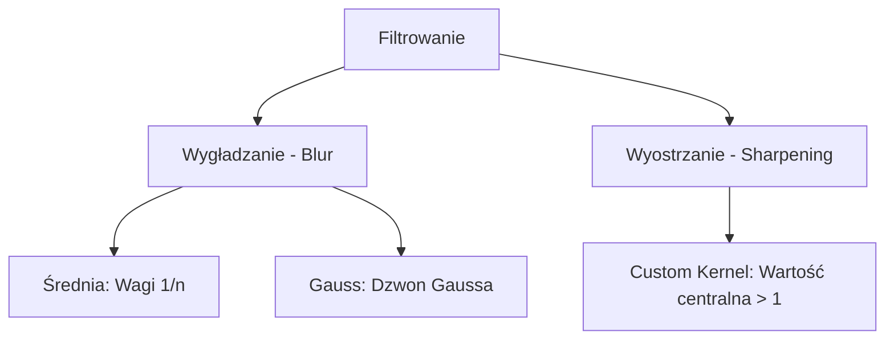

# Wykład 3: Filtrowanie - Blurowanie i Wyostrzanie

## Filtrowanie obrazów

Filtrowanie to operacja, która modyfikuje piksel na podstawie wartości jego sąsiadów. Wykorzystuje do tego celu tzw. **jądro (kernel)** lub **maskę**.

### Jak działa kernel (Splot / Konwolucja)?

Kernel to mała macierz (np. 3x3 lub 5x5), którą "przesuwamy" nad obrazem. Nowa wartość piksela to suma iloczynów sąsiednich pikseli przez wagi z kernela.

**Przykład kernela uśredniającego (Box Filter) 3x3:**

```text
[ 1/9, 1/9, 1/9 ]
[ 1/9, 1/9, 1/9 ]
[ 1/9, 1/9, 1/9 ]
```



______________________________________________________________________

## 1. Blurowanie (Wygładzanie)

Głównym celem jest redukcja szumu lub ukrycie szczegółów.

| Metoda               | Funkcja OpenCV        | Opis                                                    |
| :------------------- | :-------------------- | :------------------------------------------------------ |
| **Averaging**        | `cv2.blur`            | Prosta średnia z otoczenia.                             |
| **Gaussian Blur**    | `cv2.GaussianBlur`    | Średnia ważona rozkładem Gaussa (bardziej naturalne).   |
| **Median Blur**      | `cv2.medianBlur`      | Wybiera medianę. Najlepszy na szum typu "sól i pieprz". |
| **Bilateral Filter** | `cv2.bilateralFilter` | Wygładza tekstury, ale **zachowuje krawędzie**.         |

### Przykład w Pythonie:

```python
import cv2

img = cv2.imread("obrazki/bird.jpg")

# Rozmycie Gaussowskie (3x3 kernel, 0 - sigma)
blurred = cv2.GaussianBlur(img, (3, 3), 0)

# Rozmycie Medianowe (ksize=3)
median = cv2.medianBlur(img, 3)

cv2.imshow("Original", img)
cv2.imshow("Gaussian", blurred)
cv2.waitKey(0)
```

______________________________________________________________________

## 2. Wyostrzanie

Wyostrzanie polega na wzmocnieniu różnic między pikselami.

### Manualne wyostrzanie (Kernel Custom)

Możemy zdefiniować własny kernel wyostrzający:

```python
import numpy as np

# Kernel wyostrzający
kernel = np.array([[0, -1, 0], [-1, 5, -1], [0, -1, 0]])

sharpened = cv2.filter2D(img, -1, kernel)
```

### Unsharp Masking

Polega na odjęciu rozmytego obrazu od oryginału, co uwydatnia krawędzie.

```python
# Unsharp Masking w OpenCV
gaussian_3 = cv2.GaussianBlur(img, (0, 0), 2.0)
unsharp_image = cv2.addWeighted(img, 1.5, gaussian_3, -0.5, 0)
```

______________________________________________________________________

## Wizualizacja: Rozmycie vs Wyostrzanie



______________________________________________________________________

## Filtrowanie - Porównanie Kerneli


