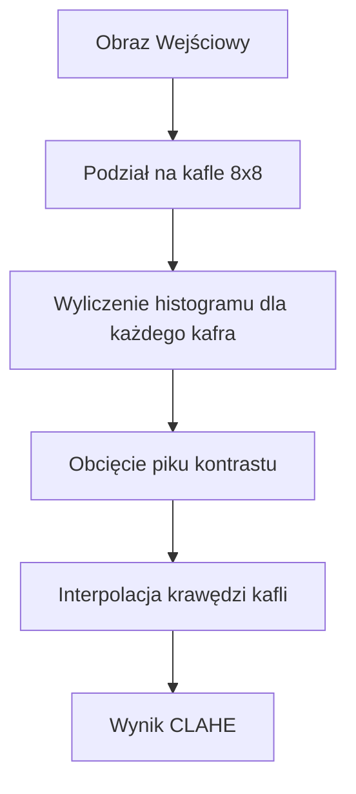
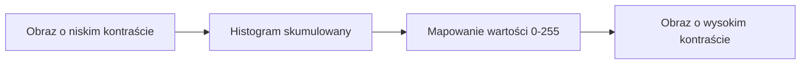

# Wykład 4: Histogramy i Equalizacja

## Czym jest Histogram?

Histogram to wykres słupkowy, który pokazuje, ile pikseli o danej jasności znajduje się na obrazie.

- **Oś X:** Reprezentuje jasność (0-255).
- **Oś Y:** Reprezentuje liczbę pikseli o tej jasności.

______________________________________________________________________

## Wyliczanie histogramu w OpenCV

```python
import cv2
import matplotlib.pyplot as plt

img = cv2.imread("obrazki/bird.jpg", cv2.IMREAD_GRAYSCALE)

# cv2.calcHist(images, channels, mask, histSize, ranges)
hist = cv2.calcHist([img], [0], None, [256], [0, 256])

plt.plot(hist)
plt.title("Histogram jasności")
plt.xlabel("Wartość piksela")
plt.ylabel("Liczba pikseli")
plt.show()
```

### Histogramy dla obrazów kolorowych

W przypadku obrazów RGB (BGR), wyliczamy osobny histogram dla każdego kanału.

```python
img_color = cv2.imread("obrazki/bird.jpg")
colors = ("b", "g", "r")

for i, col in enumerate(colors):
    hist = cv2.calcHist([img_color], [i], None, [256], [0, 256])
    plt.plot(hist, color=col)
    plt.xlim([0, 256])

plt.title("Histogram dla kanałów BGR")
plt.show()
```

______________________________________________________________________

## Equalizacja (Wyrównanie) Histogramu

Pozwala na poprawę kontrastu obrazu. Piksele są "rozciągane" po całej skali (0-255).

| Metoda                  | Funkcja OpenCV     | Zaleta                                                  |
| :---------------------- | :----------------- | :------------------------------------------------------ |
| **Global Equalization** | `cv2.equalizeHist` | Prosta, dla całego obrazu.                              |
| **CLAHE**               | `cv2.createCLAHE`  | Lokalna, zapobiega prześwietleniom w jasnych miejscach. |

### Dlaczego CLAHE? (Contrast Limited Adaptive Histogram Equalization)

Tradycyjna equalizacja często sprawia, że szum w ciemnych miejscach staje się bardzo widoczny. CLAHE dzieli obraz na małe kafelki (np. 8x8) i wyrównuje je osobno, ograniczając kontrast, aby uniknąć błędów.



```python
# Przykład CLAHE
clahe = cv2.createCLAHE(clipLimit=2.0, tileGridSize=(8, 8))
equalized = clahe.apply(img)
```

______________________________________________________________________

## Diagram: Proces Equalizacji


