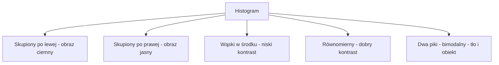
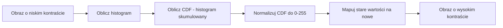
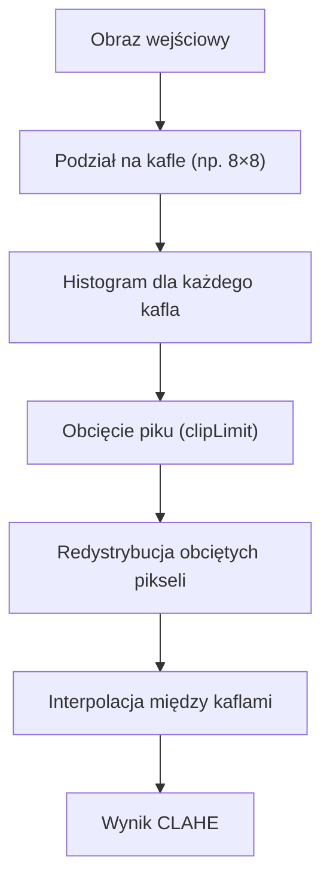
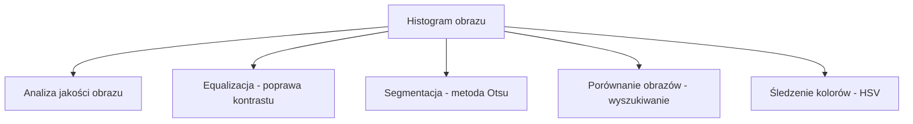

# Wykład 4: Histogramy i Equalizacja

## Czym jest Histogram?

Histogram obrazu to wykres słupkowy pokazujący **rozkład jasności pikseli** – ile pikseli o danej wartości (0–255) znajduje się na obrazie.

- **Oś X:** Wartość jasności piksela (0 = czarny, 255 = biały)
- **Oś Y:** Liczba pikseli o danej jasności

### Co histogram mówi o obrazie?

| Wygląd histogramu              | Interpretacja                        |
| :----------------------------- | :----------------------------------- |
| Skupiony po lewej stronie      | Obraz ciemny (niedoświetlony)        |
| Skupiony po prawej stronie     | Obraz jasny (prześwietlony)          |
| Skupiony w środku              | Niski kontrast (szary, mdły)         |
| Rozłożony równomiernie (0–255) | Dobry kontrast                       |
| Dwa wyraźne piki (bimodalny)   | Wyraźne tło i obiekt – dobry do Otsu |

### Diagram: Typy histogramów



______________________________________________________________________

## Wyliczanie histogramu w OpenCV

### Histogram dla obrazu w skali szarości

```python
import cv2
import matplotlib.pyplot as plt

img = cv2.imread("obrazki/bird.jpg", cv2.IMREAD_GRAYSCALE)

# cv2.calcHist(images, channels, mask, histSize, ranges)
# images  – lista obrazów wejściowych
# channels – [0] dla szarości, [0],[1],[2] dla BGR
# mask    – None = cały obraz, lub maska binarna
# histSize – liczba przedziałów (bins), zazwyczaj [256]
# ranges  – zakres wartości [0, 256]
hist = cv2.calcHist([img], [0], None, [256], [0, 256])

plt.figure(figsize=(10, 4))
plt.plot(hist, color="gray")
plt.fill_between(range(256), hist.flatten(), alpha=0.3, color="gray")
plt.title("Histogram jasności")
plt.xlabel("Wartość piksela (0–255)")
plt.ylabel("Liczba pikseli")
plt.xlim([0, 256])
plt.grid(True, alpha=0.3)
plt.show()
```

### Histogram dla obrazów kolorowych (BGR)

```python
import cv2
import matplotlib.pyplot as plt

img = cv2.imread("obrazki/bird.jpg")

kolory = [("Niebieski", 0, "blue"), ("Zielony", 1, "green"), ("Czerwony", 2, "red")]

plt.figure(figsize=(10, 4))
for nazwa, kanal, kolor in kolory:
    hist = cv2.calcHist([img], [kanal], None, [256], [0, 256])
    plt.plot(hist, color=kolor, label=nazwa)

plt.title("Histogram kanałów BGR")
plt.xlabel("Wartość piksela")
plt.ylabel("Liczba pikseli")
plt.xlim([0, 256])
plt.legend()
plt.grid(True, alpha=0.3)
plt.show()
```

### Histogram z maską (tylko fragment obrazu)

```python
import cv2
import numpy as np
import matplotlib.pyplot as plt

img = cv2.imread("obrazki/bird.jpg", cv2.IMREAD_GRAYSCALE)

# Tworzenie maski – biały prostokąt = obszar analizy
mask = np.zeros(img.shape, dtype="uint8")
mask[100:300, 100:400] = 255  # analizuj tylko ten obszar

# Histogram tylko dla zamaskowanego obszaru
hist_full = cv2.calcHist([img], [0], None, [256], [0, 256])
hist_mask = cv2.calcHist([img], [0], mask, [256], [0, 256])

plt.figure(figsize=(10, 4))
plt.plot(hist_full, label="Cały obraz", color="gray")
plt.plot(hist_mask, label="Zamaskowany obszar", color="blue")
plt.legend()
plt.title("Histogram z maską vs pełny")
plt.show()
```

______________________________________________________________________

## Equalizacja (Wyrównanie) Histogramu

Equalizacja poprawia kontrast obrazu przez **rozciągnięcie histogramu** na cały zakres 0–255.

### Jak działa equalizacja?

1. Oblicz histogram obrazu
1. Oblicz **skumulowany histogram** (CDF – Cumulative Distribution Function)
1. Znormalizuj CDF do zakresu 0–255
1. Użyj CDF jako tablicy mapowania: stara wartość → nowa wartość

```
Nowa_wartość(p) = round( CDF(p) / CDF_max * 255 )
```

### Diagram: Proces equalizacji



### Globalna equalizacja – cv2.equalizeHist

```python
import cv2
import matplotlib.pyplot as plt

img = cv2.imread("obrazki/bird.jpg", cv2.IMREAD_GRAYSCALE)

# Equalizacja działa tylko na obrazach w skali szarości!
equalized = cv2.equalizeHist(img)

# Porównanie histogramów
fig, axes = plt.subplots(2, 2, figsize=(12, 8))

axes[0, 0].imshow(img, cmap="gray")
axes[0, 0].set_title("Oryginał")

axes[0, 1].imshow(equalized, cmap="gray")
axes[0, 1].set_title("Po equalizacji")

hist_orig = cv2.calcHist([img], [0], None, [256], [0, 256])
hist_eq = cv2.calcHist([equalized], [0], None, [256], [0, 256])

axes[1, 0].plot(hist_orig, color="gray")
axes[1, 0].set_title("Histogram oryginału")
axes[1, 0].set_xlim([0, 256])

axes[1, 1].plot(hist_eq, color="blue")
axes[1, 1].set_title("Histogram po equalizacji")
axes[1, 1].set_xlim([0, 256])

plt.tight_layout()
plt.show()
```

### Equalizacja obrazu kolorowego

Equalizacja bezpośrednio na kanałach BGR daje nienaturalne kolory. Lepiej przekonwertować do HSV i wyrównać tylko kanał V (jasność):

```python
import cv2

img = cv2.imread("obrazki/bird.jpg")

# Konwersja do HSV
hsv = cv2.cvtColor(img, cv2.COLOR_BGR2HSV)
h, s, v = cv2.split(hsv)

# Equalizacja tylko kanału V (jasność)
v_eq = cv2.equalizeHist(v)

# Scalenie i konwersja z powrotem
hsv_eq = cv2.merge([h, s, v_eq])
result = cv2.cvtColor(hsv_eq, cv2.COLOR_HSV2BGR)

cv2.imshow("Oryginał", img)
cv2.imshow("Equalizacja HSV", result)
cv2.waitKey(0)
cv2.destroyAllWindows()
```

______________________________________________________________________

## CLAHE – Adaptacyjna Equalizacja

### Problem z globalną equalizacją

Globalna equalizacja traktuje cały obraz jednakowo. Jeśli obraz ma obszary bardzo jasne i bardzo ciemne, wynik może być nienaturalny – szum w ciemnych miejscach zostaje wzmocniony.

### Rozwiązanie: CLAHE

**CLAHE** (Contrast Limited Adaptive Histogram Equalization) dzieli obraz na małe kafelki i wyrównuje każdy z nich osobno, z ograniczeniem maksymalnego kontrastu (`clipLimit`).



```python
import cv2
import matplotlib.pyplot as plt

img = cv2.imread("obrazki/bird.jpg", cv2.IMREAD_GRAYSCALE)

# Globalna equalizacja
eq_global = cv2.equalizeHist(img)

# CLAHE
# clipLimit – maksymalny kontrast (im wyższy, tym mocniejszy efekt)
# tileGridSize – rozmiar siatki kafelków
clahe = cv2.createCLAHE(clipLimit=2.0, tileGridSize=(8, 8))
eq_clahe = clahe.apply(img)

# Porównanie
fig, axes = plt.subplots(1, 3, figsize=(15, 5))
for ax, obraz, tytul in zip(
    axes, [img, eq_global, eq_clahe], ["Oryginał", "Globalna equalizacja", "CLAHE"]
):
    ax.imshow(obraz, cmap="gray")
    ax.set_title(tytul)
    ax.axis("off")
plt.tight_layout()
plt.show()
```

### Porównanie: Globalna vs CLAHE

| Cecha              | Globalna equalizacja  | CLAHE                         |
| :----------------- | :-------------------- | :---------------------------- |
| Obszar działania   | Cały obraz            | Lokalne kafelki               |
| Wzmocnienie szumu  | Duże                  | Ograniczone przez `clipLimit` |
| Naturalność wyniku | Może być nienaturalna | Bardziej naturalna            |
| Zastosowanie       | Proste obrazy         | Zdjęcia medyczne, portrety    |
| Szybkość           | Bardzo szybka         | Wolniejsza                    |

______________________________________________________________________

## Porównanie histogramów dwóch obrazów

Histogramy można porównywać, aby sprawdzić podobieństwo obrazów (np. do wyszukiwania obrazów):

```python
import cv2

img1 = cv2.imread("obrazki/bird.jpg")
img2 = cv2.imread("obrazki/duze/obrazek.jpg")

# Konwersja do HSV
hsv1 = cv2.cvtColor(img1, cv2.COLOR_BGR2HSV)
hsv2 = cv2.cvtColor(img2, cv2.COLOR_BGR2HSV)

# Obliczenie histogramów 2D (H i S)
hist1 = cv2.calcHist([hsv1], [0, 1], None, [50, 60], [0, 180, 0, 256])
hist2 = cv2.calcHist([hsv2], [0, 1], None, [50, 60], [0, 180, 0, 256])

# Normalizacja
cv2.normalize(hist1, hist1, 0, 1, cv2.NORM_MINMAX)
cv2.normalize(hist2, hist2, 0, 1, cv2.NORM_MINMAX)

# Porównanie metodami:
# CORREL (korelacja): 1 = identyczne, -1 = przeciwne
# CHISQR (chi-kwadrat): 0 = identyczne, wyższy = bardziej różne
# INTERSECT (przecięcie): wyższy = bardziej podobne
# BHATTACHARYYA: 0 = identyczne, 1 = zupełnie różne

metody = [
    ("Korelacja", cv2.HISTCMP_CORREL),
    ("Chi-kwadrat", cv2.HISTCMP_CHISQR),
    ("Przecięcie", cv2.HISTCMP_INTERSECT),
    ("Bhattacharyya", cv2.HISTCMP_BHATTACHARYYA),
]

for nazwa, metoda in metody:
    wynik = cv2.compareHist(hist1, hist2, metoda)
    print(f"{nazwa}: {wynik:.4f}")
```

______________________________________________________________________

## Diagram: Zastosowania histogramów



______________________________________________________________________

## Typowe błędy i jak ich unikać

| Problem                                 | Przyczyna                                | Rozwiązanie                               |
| :-------------------------------------- | :--------------------------------------- | :---------------------------------------- |
| `equalizeHist` nie działa na kolorowym  | Funkcja wymaga obrazu 1-kanałowego       | Konwertuj do HSV i wyrównaj tylko kanał V |
| Wynik equalizacji wygląda nienaturalnie | Globalna equalizacja na złożonym obrazie | Użyj CLAHE z niskim `clipLimit`           |
| Histogram jest płaski/pusty             | Obraz ma bardzo mały zakres jasności     | Sprawdź `img.min()` i `img.max()`         |
| CLAHE wzmacnia szum                     | `clipLimit` zbyt wysoki                  | Zmniejsz `clipLimit` (np. z 4.0 do 2.0)   |

______________________________________________________________________

## Ćwiczenia praktyczne

1. Wczytaj obraz i narysuj jego histogram – oceń, czy jest dobrze naświetlony.
1. Zastosuj globalną equalizację i CLAHE – porównaj wyniki wizualnie i histogramami.
1. Dla obrazu kolorowego wykonaj equalizację przez kanał V w przestrzeni HSV.
1. Zmień parametr `clipLimit` w CLAHE (1.0, 2.0, 5.0, 10.0) i obserwuj różnice.
1. Porównaj histogramy dwóch różnych obrazów metodą korelacji i Bhattacharyya.
1. Napisz funkcję, która automatycznie ocenia jakość naświetlenia obrazu na podstawie histogramu.
