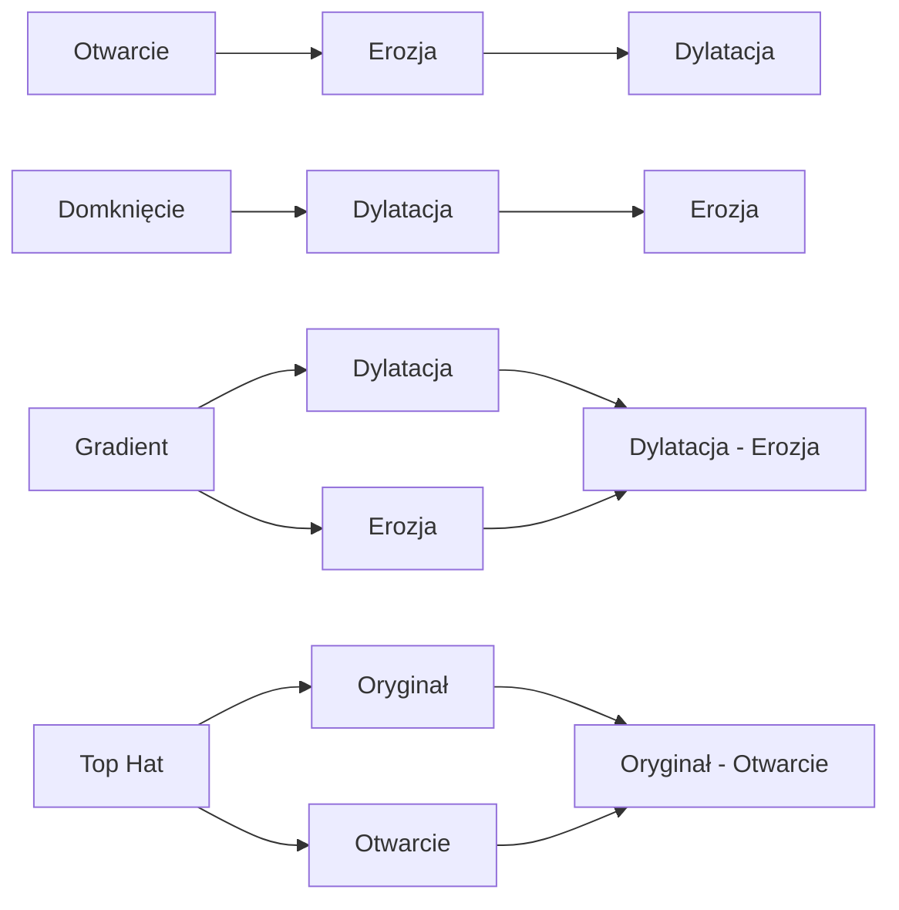
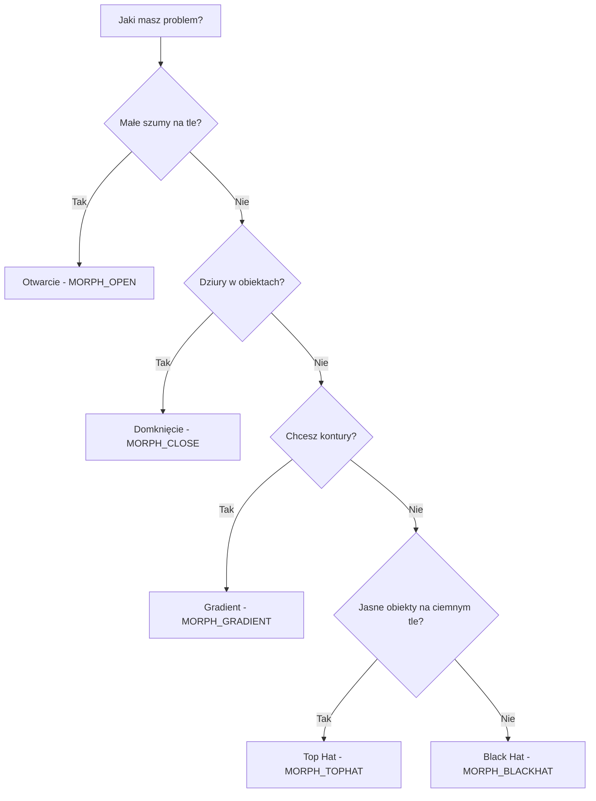
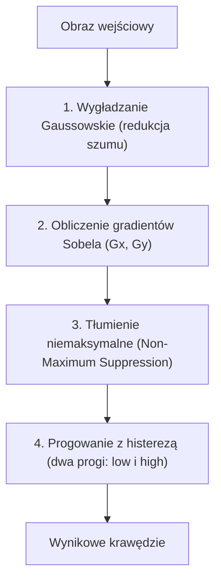
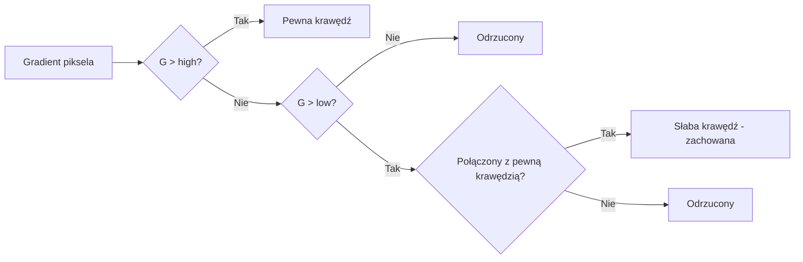
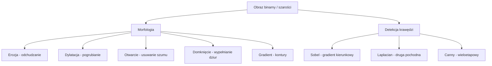

# Wykład 5: Morfologia i Detekcja Krawędzi

## 1. Operacje Morfologiczne

Morfologia matematyczna to zestaw operacji na obrazach binarnych (lub w skali szarości), które **modyfikują kształty obiektów** na podstawie ich struktury i elementu strukturyzującego (kernela).

### Element strukturyzujący (kernel)

Kernel morfologiczny definiuje **sąsiedztwo** brane pod uwagę przy każdej operacji. Może mieć różne kształty:

```python
import cv2
import numpy as np

# Prostokątny (domyślny)
kernel_rect = cv2.getStructuringElement(cv2.MORPH_RECT, (5, 5))
# Eliptyczny
kernel_ellip = cv2.getStructuringElement(cv2.MORPH_ELLIPSE, (5, 5))
# Krzyżowy
kernel_cross = cv2.getStructuringElement(cv2.MORPH_CROSS, (5, 5))

# Lub ręcznie:
kernel_manual = np.ones((5, 5), np.uint8)
```

### Podstawowe operacje morfologiczne

| Operacja                   | Opis                                                               | Efekt                                           |
| :------------------------- | :----------------------------------------------------------------- | :---------------------------------------------- |
| **Erozja (Erosion)**       | Piksel biały tylko jeśli **wszystkie** piksele w kernelu są białe. | "Odchudzanie" obiektów, usuwanie małych szumów. |
| **Dylatacja (Dilation)**   | Piksel biały jeśli **chociaż jeden** piksel w kernelu jest biały.  | "Pogrubianie" obiektów, łączenie przerw.        |
| **Otwarcie (Opening)**     | Erozja → Dylatacja.                                                | Usuwanie małych szumów z tła (małych kropek).   |
| **Domknięcie (Closing)**   | Dylatacja → Erozja.                                                | Zamykanie małych dziur wewnątrz obiektów.       |
| **Gradient morfologiczny** | Dylatacja − Erozja.                                                | Kontur obiektu (krawędzie).                     |
| **Top Hat**                | Oryginał − Otwarcie.                                               | Jasne obiekty na ciemnym tle.                   |
| **Black Hat**              | Domknięcie − Oryginał.                                             | Ciemne obiekty na jasnym tle.                   |

### Diagram: Operacje złożone



### Diagram: Kiedy stosować którą operację?



______________________________________________________________________

## Przykłady w Pythonie

### Podstawowe operacje

```python
import cv2
import numpy as np
import matplotlib.pyplot as plt

img = cv2.imread("obrazki/bird.jpg", cv2.IMREAD_GRAYSCALE)
_, binary = cv2.threshold(img, 127, 255, cv2.THRESH_BINARY)

kernel = cv2.getStructuringElement(cv2.MORPH_RECT, (5, 5))

erosion = cv2.erode(binary, kernel, iterations=1)
dilation = cv2.dilate(binary, kernel, iterations=1)
opening = cv2.morphologyEx(binary, cv2.MORPH_OPEN, kernel)
closing = cv2.morphologyEx(binary, cv2.MORPH_CLOSE, kernel)
gradient = cv2.morphologyEx(binary, cv2.MORPH_GRADIENT, kernel)
tophat = cv2.morphologyEx(binary, cv2.MORPH_TOPHAT, kernel)
blackhat = cv2.morphologyEx(binary, cv2.MORPH_BLACKHAT, kernel)

obrazy = [binary, erosion, dilation, opening, closing, gradient, tophat, blackhat]
tytuly = [
    "Binarny",
    "Erozja",
    "Dylatacja",
    "Otwarcie",
    "Domknięcie",
    "Gradient",
    "Top Hat",
    "Black Hat",
]

fig, axes = plt.subplots(2, 4, figsize=(20, 10))
for ax, obraz, tytul in zip(axes.flatten(), obrazy, tytuly):
    ax.imshow(obraz, cmap="gray")
    ax.set_title(tytul)
    ax.axis("off")
plt.tight_layout()
plt.show()
```

### Iteracje – wpływ liczby powtórzeń

```python
import cv2
import numpy as np
import matplotlib.pyplot as plt

img = cv2.imread("obrazki/bird.jpg", cv2.IMREAD_GRAYSCALE)
_, binary = cv2.threshold(img, 127, 255, cv2.THRESH_BINARY)
kernel = np.ones((3, 3), np.uint8)

fig, axes = plt.subplots(1, 5, figsize=(20, 4))
axes[0].imshow(binary, cmap="gray")
axes[0].set_title("Oryginał")

for i, n in enumerate([1, 2, 4, 8], 1):
    eroded = cv2.erode(binary, kernel, iterations=n)
    axes[i].imshow(eroded, cmap="gray")
    axes[i].set_title(f"Erozja x{n}")

plt.tight_layout()
plt.show()
```

### Praktyczne zastosowanie: usuwanie szumu

```python
import cv2
import numpy as np

img = cv2.imread("obrazki/bird.jpg", cv2.IMREAD_GRAYSCALE)
_, binary = cv2.threshold(img, 127, 255, cv2.THRESH_BINARY)

# Dodanie sztucznego szumu (małe białe kropki)
noise = binary.copy()
noise_points = np.random.randint(0, 2, binary.shape).astype(np.uint8) * 255
noise = cv2.bitwise_or(noise, noise_points * (binary == 0).astype(np.uint8))

kernel = np.ones((3, 3), np.uint8)

# Otwarcie usuwa małe białe szumy
cleaned = cv2.morphologyEx(noise, cv2.MORPH_OPEN, kernel)

cv2.imshow("Z szumem", noise)
cv2.imshow("Po otwarciu", cleaned)
cv2.waitKey(0)
cv2.destroyAllWindows()
```

______________________________________________________________________

## 2. Detekcja Krawędzi

Krawędź to miejsce, gdzie jasność pikseli **gwałtownie się zmienia** (duży gradient). Detekcja krawędzi jest podstawą wielu algorytmów wizji komputerowej.

### Gradient obrazu

Gradient mierzy szybkość zmiany jasności:

- **Gradient X** – zmiany w poziomie (krawędzie pionowe)
- **Gradient Y** – zmiany w pionie (krawędzie poziome)
- **Magnitude** – siła krawędzi: `M = sqrt(Gx² + Gy²)`
- **Kierunek** – kąt krawędzi: `θ = arctan(Gy / Gx)`

### Metody detekcji krawędzi

| Metoda        | Opis                                                           | Zalety                                    | Wady                        |
| :------------ | :------------------------------------------------------------- | :---------------------------------------- | :-------------------------- |
| **Sobel**     | Wylicza gradienty pionowe (X) i poziome (Y).                   | Prosta, wykrywa kierunek krawędzi.        | Czuła na szum.              |
| **Scharr**    | Ulepszona wersja Sobela z lepszą rotacyjną symetrią.           | Dokładniejsza niż Sobel.                  | Mniej popularna.            |
| **Laplacian** | Wylicza drugą pochodną obrazu (wszystkie kierunki naraz).      | Wykrywa wszystkie krawędzie jednocześnie. | Bardzo czuła na szum.       |
| **Canny**     | Wieloetapowy: Blur + Sobel + Non-max suppression + Hysteresis. | Najbardziej popularna i precyzyjna.       | Wymaga doboru dwóch progów. |

______________________________________________________________________

## Operator Sobela

Sobel używa dwóch kerneli 3×3 do obliczenia gradientów:

```
Kernel Sobel X (krawędzie pionowe):    Kernel Sobel Y (krawędzie poziome):
┌────┬───┬────┐                        ┌───┬────┬───┐
│ -1 │ 0 │ +1 │                        │ -1│ -2 │-1 │
├────┼───┼────┤                        ├───┼────┼───┤
│ -2 │ 0 │ +2 │                        │  0│  0 │ 0 │
├────┼───┼────┤                        ├───┼────┼───┤
│ -1 │ 0 │ +1 │                        │ +1│ +2 │+1 │
└────┴───┴────┘                        └───┴────┴───┘
```

```python
import cv2
import numpy as np
import matplotlib.pyplot as plt

img = cv2.imread("obrazki/bird.jpg", cv2.IMREAD_GRAYSCALE)

# Gradient X (krawędzie pionowe)
sobelX = cv2.Sobel(img, cv2.CV_64F, 1, 0, ksize=3)
# Gradient Y (krawędzie poziome)
sobelY = cv2.Sobel(img, cv2.CV_64F, 0, 1, ksize=3)

# Wartość bezwzględna i konwersja na uint8
sobelX_abs = np.uint8(np.absolute(sobelX))
sobelY_abs = np.uint8(np.absolute(sobelY))

# Połączenie gradientów (magnitude)
sobel_combined = cv2.bitwise_or(sobelX_abs, sobelY_abs)
# lub: sobel_combined = np.uint8(np.sqrt(sobelX**2 + sobelY**2).clip(0, 255))

fig, axes = plt.subplots(1, 4, figsize=(20, 5))
for ax, obraz, tytul in zip(
    axes,
    [img, sobelX_abs, sobelY_abs, sobel_combined],
    ["Oryginał", "Sobel X (pionowe)", "Sobel Y (poziome)", "Połączone"],
):
    ax.imshow(obraz, cmap="gray")
    ax.set_title(tytul)
    ax.axis("off")
plt.tight_layout()
plt.show()
```

______________________________________________________________________

## Operator Laplaciana

Laplacian oblicza **drugą pochodną** – wykrywa miejsca, gdzie gradient zmienia się najszybciej:

```python
import cv2
import numpy as np

img = cv2.imread("obrazki/bird.jpg", cv2.IMREAD_GRAYSCALE)

# Rozmycie przed Laplacianem (redukcja szumu)
blurred = cv2.GaussianBlur(img, (3, 3), 0)

# Laplacian
laplacian = cv2.Laplacian(blurred, cv2.CV_64F)
laplacian = np.uint8(np.absolute(laplacian))

cv2.imshow("Laplacian", laplacian)
cv2.waitKey(0)
cv2.destroyAllWindows()
```

______________________________________________________________________

## Algorytm Canny – krok po kroku

Canny to **wieloetapowy** algorytm detekcji krawędzi, uznawany za standard w wizji komputerowej.

### Diagram: Algorytm Canny



### Szczegóły etapów Canny

**Etap 3 – Tłumienie niemaksymalne:**
Dla każdego piksela sprawdzamy, czy jest lokalnym maksimum gradientu w kierunku krawędzi. Jeśli nie – zerujemy go. Dzięki temu krawędzie są cienkie (1 piksel).

**Etap 4 – Progowanie z histerezą:**

- Piksele z gradientem > `high_threshold` → **pewna krawędź**
- Piksele z gradientem < `low_threshold` → **odrzucone**
- Piksele między progami → **krawędź tylko jeśli połączona z pewną krawędzią**



### Przykład Canny

```python
import cv2
import matplotlib.pyplot as plt

img = cv2.imread("obrazki/bird.jpg", cv2.IMREAD_GRAYSCALE)

# Rozmycie przed Canny (opcjonalne, ale zalecane)
blurred = cv2.GaussianBlur(img, (5, 5), 0)

# cv2.Canny(image, low_threshold, high_threshold)
# Zalecana proporcja progów: high = 2x lub 3x low
canny_low = cv2.Canny(blurred, 50, 150)
canny_medium = cv2.Canny(blurred, 100, 200)
canny_high = cv2.Canny(blurred, 150, 300)

fig, axes = plt.subplots(1, 4, figsize=(20, 5))
for ax, obraz, tytul in zip(
    axes,
    [img, canny_low, canny_medium, canny_high],
    ["Oryginał", "Canny (50/150)", "Canny (100/200)", "Canny (150/300)"],
):
    ax.imshow(obraz, cmap="gray")
    ax.set_title(tytul)
    ax.axis("off")
plt.tight_layout()
plt.show()
```

### Interaktywny Canny z Trackbarem

```python
import cv2
import numpy as np

img = cv2.imread("obrazki/bird.jpg", cv2.IMREAD_GRAYSCALE)
blurred = cv2.GaussianBlur(img, (5, 5), 0)


def aktualizuj(val):
    low = cv2.getTrackbarPos("Low", "Canny")
    high = cv2.getTrackbarPos("High", "Canny")
    edges = cv2.Canny(blurred, low, high)
    cv2.imshow("Canny", edges)


cv2.namedWindow("Canny")
cv2.createTrackbar("Low", "Canny", 50, 500, aktualizuj)
cv2.createTrackbar("High", "Canny", 150, 500, aktualizuj)
aktualizuj(0)

cv2.waitKey(0)
cv2.destroyAllWindows()
```

______________________________________________________________________

## Automatyczny dobór progów Canny (metoda Otsu)

```python
import cv2
import numpy as np


def auto_canny(image, sigma=0.33):
    """Automatyczny dobór progów Canny na podstawie mediany obrazu."""
    median = np.median(image)
    low = int(max(0, (1.0 - sigma) * median))
    high = int(min(255, (1.0 + sigma) * median))
    return cv2.Canny(image, low, high)


img = cv2.imread("obrazki/bird.jpg", cv2.IMREAD_GRAYSCALE)
blurred = cv2.GaussianBlur(img, (5, 5), 0)
edges = auto_canny(blurred)

cv2.imshow("Auto Canny", edges)
cv2.waitKey(0)
cv2.destroyAllWindows()
```

______________________________________________________________________

## Porównanie metod detekcji krawędzi

```python
import cv2
import numpy as np
import matplotlib.pyplot as plt

img = cv2.imread("obrazki/bird.jpg", cv2.IMREAD_GRAYSCALE)
blurred = cv2.GaussianBlur(img, (3, 3), 0)

# Sobel
sobelX = cv2.Sobel(blurred, cv2.CV_64F, 1, 0)
sobelY = cv2.Sobel(blurred, cv2.CV_64F, 0, 1)
sobel = np.uint8(np.clip(np.sqrt(sobelX**2 + sobelY**2), 0, 255))

# Laplacian
laplacian = np.uint8(np.absolute(cv2.Laplacian(blurred, cv2.CV_64F)))

# Canny
canny = cv2.Canny(blurred, 100, 200)

fig, axes = plt.subplots(1, 4, figsize=(20, 5))
for ax, obraz, tytul in zip(
    axes, [img, sobel, laplacian, canny], ["Oryginał", "Sobel", "Laplacian", "Canny"]
):
    ax.imshow(obraz, cmap="gray")
    ax.set_title(tytul)
    ax.axis("off")
plt.tight_layout()
plt.show()
```

______________________________________________________________________

## Diagram: Morfologia vs Detekcja krawędzi



______________________________________________________________________

## Typowe błędy i jak ich unikać

| Problem                          | Przyczyna                                   | Rozwiązanie                                |
| :------------------------------- | :------------------------------------------ | :----------------------------------------- |
| Morfologia na obrazie kolorowym  | Operacje morfologiczne działają na 1 kanale | Konwertuj do skali szarości lub binarnego  |
| Canny wykrywa za dużo krawędzi   | Progi zbyt niskie                           | Zwiększ `low_threshold` i `high_threshold` |
| Canny wykrywa za mało krawędzi   | Progi zbyt wysokie                          | Zmniejsz progi lub użyj `auto_canny`       |
| Sobel daje szum zamiast krawędzi | Brak preprocessingu                         | Zastosuj `GaussianBlur` przed Sobelem      |
| Laplacian bardzo czuły na szum   | Druga pochodna wzmacnia szum                | Zawsze rozmyj obraz przed Laplacianem      |
| Erozja usuwa za dużo             | Kernel zbyt duży lub za dużo iteracji       | Zmniejsz kernel lub liczbę iteracji        |

______________________________________________________________________

## Ćwiczenia praktyczne

1. Zastosuj erozję i dylatację z różnymi rozmiarami kernela (3×3, 7×7, 15×15) – obserwuj efekty.
1. Użyj otwarcia do usunięcia szumu z obrazu binarnego, a domknięcia do wypełnienia dziur.
1. Porównaj gradient morfologiczny z wynikiem algorytmu Canny – czym się różnią?
1. Zastosuj Top Hat i Black Hat na obrazie z tekstem – co wykrywają?
1. Napisz program z trackbarem do interaktywnego doboru progów Canny.
1. Zaimplementuj funkcję `auto_canny` i przetestuj ją na kilku różnych obrazach.
1. Porównaj Sobel, Laplacian i Canny na tym samym obrazie – oceń jakość wyników.
