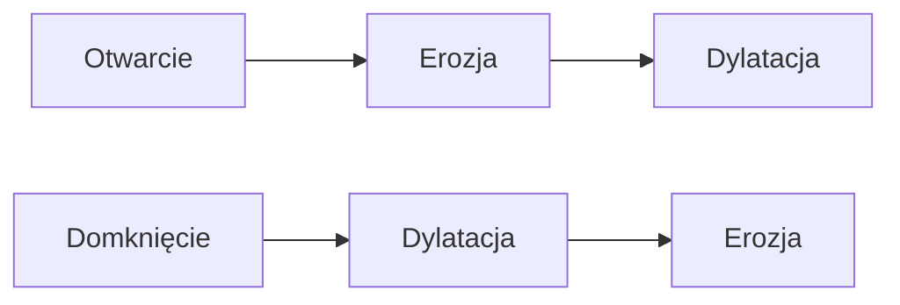
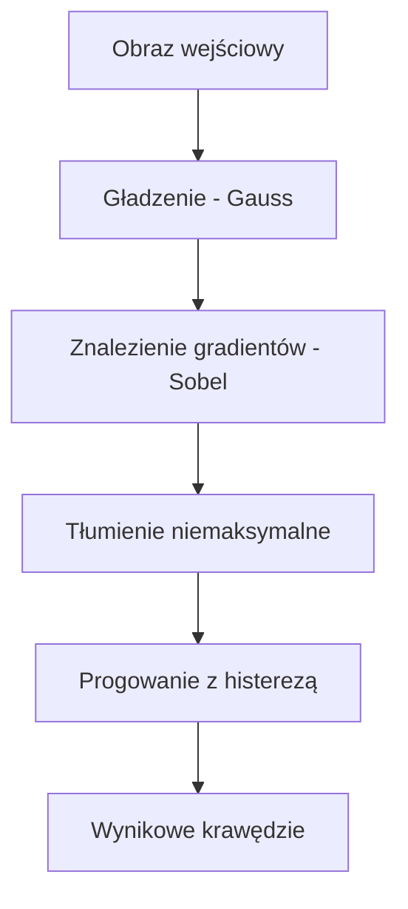

# Wykład 5: Morfologia i Detekcja Krawędzi

## 1. Operacje Morfologiczne

To operacje na obrazach binarnych, które zmieniają kształty obiektów na podstawie ich struktury.

### Podstawowe operacje:

| Operacja                 | Opis                                                                  | Efekt                                           |
| :----------------------- | :-------------------------------------------------------------------- | :---------------------------------------------- |
| **Erozja (Erosion)**     | Piksel centralny biały, jeśli **wszystkie** w kernelu są białe.       | "Odchudzanie" obiektów, usuwanie małych szumów. |
| **Dylatacja (Dilation)** | Piksel centralny biały, jeśli **chociaż jeden** w kernelu jest biały. | "Pogrubianie" obiektów, łączenie przerw.        |
| **Otwarcie (Opening)**   | Erozja, a potem Dylatacja.                                            | Usuwanie szumów z tła (małych kropek).          |
| **Domknięcie (Closing)** | Dylatacja, a potem Erozja.                                            | Zamykanie małych dziur wewnątrz obiektów.       |

### Przykład w Pythonie:

```python
import cv2
import numpy as np

img = cv2.imread("obrazki/bird.jpg", 0)
kernel = np.ones((5, 5), np.uint8)

erosion = cv2.erode(img, kernel, iterations=1)
dilation = cv2.dilate(img, kernel, iterations=1)
opening = cv2.morphologyEx(img, cv2.MORPH_OPEN, kernel)
closing = cv2.morphologyEx(img, cv2.MORPH_CLOSE, kernel)
```

### Wizualizacja operacji złożonych



______________________________________________________________________

## 2. Detekcja Krawędzi

Krawędź to miejsce, gdzie jasność pikseli gwałtownie się zmienia (duży gradient).

### Metody:

| Metoda        | Opis                                                                     | Zalety                                           |
| :------------ | :----------------------------------------------------------------------- | :----------------------------------------------- |
| **Sobel**     | Wylicza gradienty pionowe (Sobel X) i poziome (Sobel Y).                 | Prosta, pozwala wykryć kierunek krawędzi.        |
| **Laplacian** | Wylicza drugą pochodną obrazu.                                           | Bardziej czuła na szum, ale daje wyraźne obrysy. |
| **Canny**     | Algorytm wieloetapowy (Blur + Sobel + Non-max suppression + Hysteresis). | Najbardziej popularna i precyzyjna metoda.       |

### Przykład Canny:

```python
# cv2.Canny(image, low_threshold, high_threshold)
edges = cv2.Canny(img, 100, 200)

cv2.imshow("Edges", edges)
cv2.waitKey(0)
```

### Sobel - Detekcja kierunkowa

Operator Sobela pozwala wykryć krawędzie konkretnie pionowe lub poziome.

```python
# Gradient X (pionowe krawędzie)
sobelX = cv2.Sobel(img, cv2.CV_64F, 1, 0)
# Gradient Y (poziome krawędzie)
sobelY = cv2.Sobel(img, cv2.CV_64F, 0, 1)

# Konwersja z powrotem na uint8
sobelX = np.uint8(np.absolute(sobelX))
sobelY = np.uint8(np.absolute(sobelY))
```

______________________________________________________________________

## Diagram: Algorytm Canny


