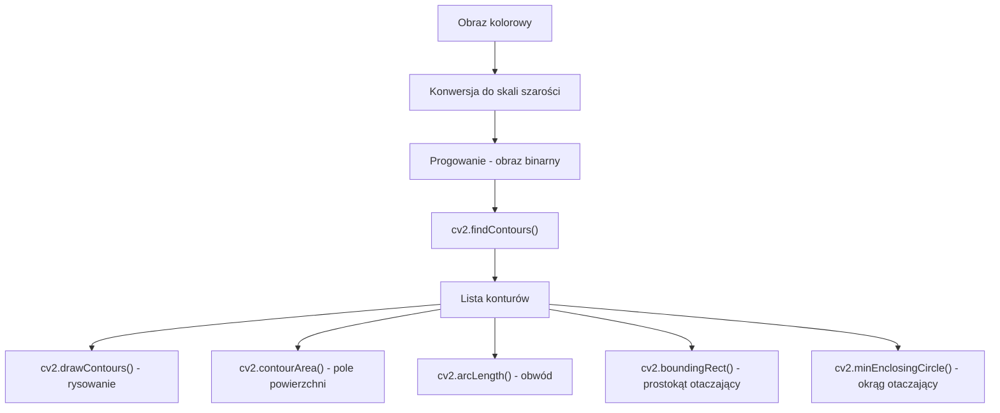
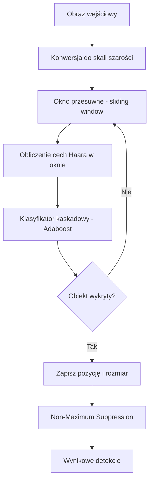
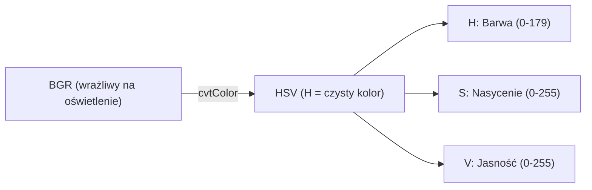
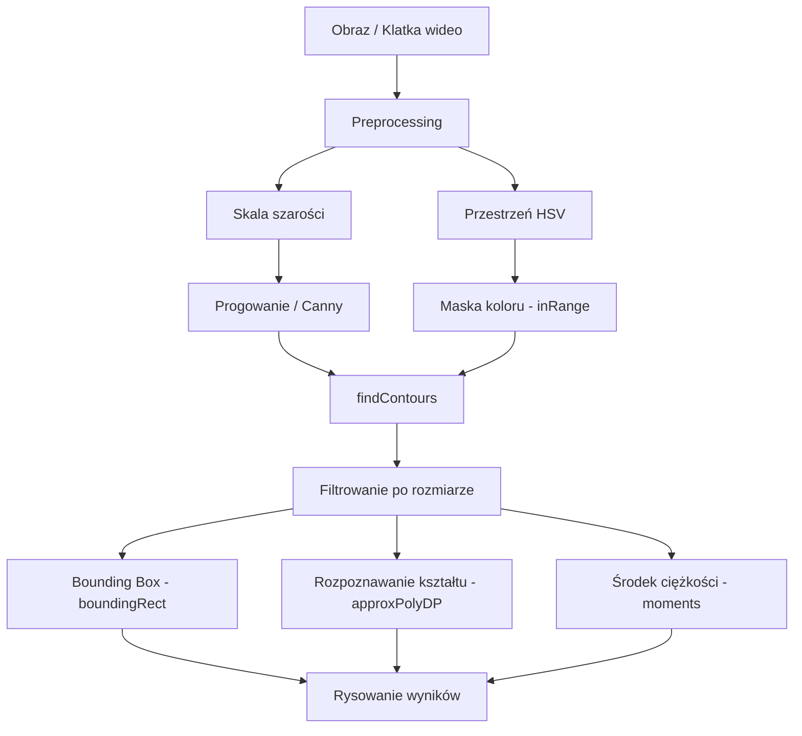

# Wykład 6: Kontury i Detekcja Obiektów

## 1. Kontury

Kontur to krzywa łącząca wszystkie punkty graniczne obiektu o tej samej jasności. W OpenCV kontury są reprezentowane jako listy punktów (x, y).

### Zastosowania konturów

- Wykrywanie i liczenie obiektów na obrazie
- Pomiar powierzchni i obwodu obiektów
- Rozpoznawanie kształtów
- Śledzenie obiektów w wideo

______________________________________________________________________

## Znajdowanie konturów

### Diagram: Przepływ pracy z konturami



```python
import cv2
import numpy as np

img = cv2.imread("obrazki/bird.jpg")
gray = cv2.cvtColor(img, cv2.COLOR_BGR2GRAY)

# Progowanie – kontury działają na obrazach binarnych
_, binary = cv2.threshold(gray, 127, 255, cv2.THRESH_BINARY)

# Znajdowanie konturów
# RETR_EXTERNAL – tylko zewnętrzne kontury
# RETR_LIST     – wszystkie kontury bez hierarchii
# RETR_TREE     – wszystkie kontury z pełną hierarchią
# CHAIN_APPROX_SIMPLE  – tylko punkty narożne (oszczędność pamięci)
# CHAIN_APPROX_NONE    – wszystkie punkty konturu
contours, hierarchy = cv2.findContours(
    binary, cv2.RETR_EXTERNAL, cv2.CHAIN_APPROX_SIMPLE
)

print(f"Liczba konturów: {len(contours)}")

# Rysowanie wszystkich konturów (zielony, grubość 2)
img_contours = img.copy()
cv2.drawContours(img_contours, contours, -1, (0, 255, 0), 2)
# -1 = rysuj wszystkie; podaj indeks (np. 0) aby rysować jeden kontur

cv2.imshow("Kontury", img_contours)
cv2.waitKey(0)
cv2.destroyAllWindows()
```

______________________________________________________________________

## Właściwości konturów

### Pole powierzchni i obwód

```python
import cv2
import numpy as np

img = cv2.imread("obrazki/bird.jpg")
gray = cv2.cvtColor(img, cv2.COLOR_BGR2GRAY)
_, binary = cv2.threshold(gray, 127, 255, cv2.THRESH_BINARY)
contours, _ = cv2.findContours(binary, cv2.RETR_EXTERNAL, cv2.CHAIN_APPROX_SIMPLE)

for i, cnt in enumerate(contours):
    area = cv2.contourArea(cnt)
    perimeter = cv2.arcLength(cnt, closed=True)
    print(f"Kontur {i}: pole={area:.1f}px², obwód={perimeter:.1f}px")
```

### Filtrowanie konturów po rozmiarze

```python
# Zachowaj tylko kontury o polu > 500 px²
duze_kontury = [cnt for cnt in contours if cv2.contourArea(cnt) > 500]
print(f"Duże kontury: {len(duze_kontury)}")
```

### Prostokąt otaczający (Bounding Box)

```python
img_copy = img.copy()

for cnt in contours:
    if cv2.contourArea(cnt) < 500:
        continue

    # Prostokąt wyrównany do osi (x, y, szerokość, wysokość)
    x, y, w, h = cv2.boundingRect(cnt)
    cv2.rectangle(img_copy, (x, y), (x + w, y + h), (0, 255, 0), 2)

    # Prostokąt obrócony (minimalny obszar)
    rect = cv2.minAreaRect(cnt)
    box = np.int0(cv2.boxPoints(rect))
    cv2.drawContours(img_copy, [box], 0, (0, 0, 255), 2)

cv2.imshow("Bounding Box", img_copy)
cv2.waitKey(0)
cv2.destroyAllWindows()
```

### Okrąg i elipsa otaczająca

```python
img_copy = img.copy()

for cnt in contours:
    if cv2.contourArea(cnt) < 500:
        continue

    # Minimalny okrąg otaczający
    (cx, cy), radius = cv2.minEnclosingCircle(cnt)
    cv2.circle(img_copy, (int(cx), int(cy)), int(radius), (255, 0, 0), 2)

    # Środek ciężkości (centroid) przez momenty
    M = cv2.moments(cnt)
    if M["m00"] != 0:
        cX = int(M["m10"] / M["m00"])
        cY = int(M["m01"] / M["m00"])
        cv2.circle(img_copy, (cX, cY), 5, (0, 0, 255), -1)

cv2.imshow("Okrąg otaczający", img_copy)
cv2.waitKey(0)
cv2.destroyAllWindows()
```

### Aproksymacja kształtu konturu

```python
img_copy = img.copy()

for cnt in contours:
    if cv2.contourArea(cnt) < 500:
        continue

    # Aproksymacja wielokątem (epsilon = dokładność)
    epsilon = 0.02 * cv2.arcLength(cnt, True)
    approx = cv2.approxPolyDP(cnt, epsilon, True)

    # Rozpoznawanie kształtu po liczbie wierzchołków
    n = len(approx)
    if n == 3:
        ksztalt = "Trojkat"
    elif n == 4:
        ksztalt = "Czworobok"
    elif n == 5:
        ksztalt = "Pieciokat"
    else:
        ksztalt = "Okrag"

    x, y, _, _ = cv2.boundingRect(approx)
    cv2.drawContours(img_copy, [approx], -1, (0, 255, 0), 2)
    cv2.putText(
        img_copy, ksztalt, (x, y - 10), cv2.FONT_HERSHEY_SIMPLEX, 0.5, (0, 0, 255), 1
    )

cv2.imshow("Rozpoznawanie kształtów", img_copy)
cv2.waitKey(0)
cv2.destroyAllWindows()
```

______________________________________________________________________

## 2. Detekcja Twarzy – Haar Cascade

Haar Cascade to klasyczny algorytm detekcji obiektów oparty na cechach Haara i klasyfikatorze Adaboost. Jest szybki i działa w czasie rzeczywistym.

### Diagram: Jak działa Haar Cascade?



### Przykład: Detekcja twarzy

```python
import cv2

img = cv2.imread("obrazki/duze/people-with-glasses-composition.jpg")
gray = cv2.cvtColor(img, cv2.COLOR_BGR2GRAY)

# Wczytanie klasyfikatora
face_cascade = cv2.CascadeClassifier("cascades/haarcascade_frontalface_default.xml")

# detectMultiScale(image, scaleFactor, minNeighbors, minSize)
# scaleFactor  – o ile zmniejszamy obraz w każdej skali (1.1 = 10%)
# minNeighbors – ile sąsiednich detekcji wymagamy (wyższy = mniej fałszywych)
# minSize      – minimalny rozmiar wykrywanego obiektu
faces = face_cascade.detectMultiScale(
    gray, scaleFactor=1.1, minNeighbors=5, minSize=(30, 30)
)

print(f"Wykryto twarzy: {len(faces)}")

for x, y, w, h in faces:
    cv2.rectangle(img, (x, y), (x + w, y + h), (0, 255, 0), 2)
    cv2.putText(
        img, "Twarz", (x, y - 10), cv2.FONT_HERSHEY_SIMPLEX, 0.7, (0, 255, 0), 2
    )

cv2.imshow("Detekcja twarzy", img)
cv2.waitKey(0)
cv2.destroyAllWindows()
```

### Detekcja twarzy i oczu jednocześnie

```python
import cv2

img = cv2.imread("obrazki/duze/people-with-glasses-composition.jpg")
gray = cv2.cvtColor(img, cv2.COLOR_BGR2GRAY)

face_cascade = cv2.CascadeClassifier("cascades/haarcascade_frontalface_default.xml")
eye_cascade = cv2.CascadeClassifier("cascades/haarcascade_eye.xml")

faces = face_cascade.detectMultiScale(gray, 1.1, 5, minSize=(30, 30))

for fx, fy, fw, fh in faces:
    cv2.rectangle(img, (fx, fy), (fx + fw, fy + fh), (0, 255, 0), 2)

    # Szukaj oczu tylko wewnątrz obszaru twarzy (ROI)
    roi_gray = gray[fy : fy + fh, fx : fx + fw]
    roi_color = img[fy : fy + fh, fx : fx + fw]

    eyes = eye_cascade.detectMultiScale(roi_gray, 1.1, 10, minSize=(15, 15))
    for ex, ey, ew, eh in eyes:
        cv2.rectangle(roi_color, (ex, ey), (ex + ew, ey + eh), (255, 0, 0), 2)

cv2.imshow("Twarze i oczy", img)
cv2.waitKey(0)
cv2.destroyAllWindows()
```

### Detekcja w czasie rzeczywistym (kamera)

```python
import cv2

face_cascade = cv2.CascadeClassifier("cascades/haarcascade_frontalface_default.xml")

cap = cv2.VideoCapture(0)  # 0 = domyślna kamera

while True:
    ret, frame = cap.read()
    if not ret:
        break

    gray = cv2.cvtColor(frame, cv2.COLOR_BGR2GRAY)
    faces = face_cascade.detectMultiScale(gray, 1.1, 5, minSize=(30, 30))

    for x, y, w, h in faces:
        cv2.rectangle(frame, (x, y), (x + w, y + h), (0, 255, 0), 2)

    cv2.putText(
        frame,
        f"Twarze: {len(faces)}",
        (10, 30),
        cv2.FONT_HERSHEY_SIMPLEX,
        1,
        (0, 255, 0),
        2,
    )
    cv2.imshow("Kamera", frame)

    if cv2.waitKey(1) & 0xFF == ord("q"):
        break

cap.release()
cv2.destroyAllWindows()
```

______________________________________________________________________

## 3. Śledzenie kolorów (Color Tracking)

Śledzenie obiektów na podstawie koloru w przestrzeni HSV.

### Dlaczego HSV zamiast BGR?

W przestrzeni BGR kolor zależy od oświetlenia – ten sam obiekt może mieć różne wartości RGB przy różnym świetle. W HSV kanał **H (Hue)** reprezentuje czysty kolor niezależnie od jasności.



### Zakresy kolorów w HSV (OpenCV)

| Kolor     | H min | H max | S min | S max | V min | V max |
| :-------- | :---- | :---- | :---- | :---- | :---- | :---- |
| Czerwony  | 0     | 10    | 100   | 255   | 100   | 255   |
| Czerwony  | 160   | 179   | 100   | 255   | 100   | 255   |
| Zielony   | 40    | 80    | 50    | 255   | 50    | 255   |
| Niebieski | 100   | 130   | 50    | 255   | 50    | 255   |
| Żółty     | 20    | 35    | 100   | 255   | 100   | 255   |

> **Uwaga:** Czerwony w HSV leży na granicy (0 i 179), dlatego wymaga dwóch masek!

### Przykład: Śledzenie zielonego obiektu

```python
import cv2
import numpy as np

cap = cv2.VideoCapture(0)

while True:
    ret, frame = cap.read()
    if not ret:
        break

    # Konwersja do HSV
    hsv = cv2.cvtColor(frame, cv2.COLOR_BGR2HSV)

    # Zakres koloru zielonego
    lower_green = np.array([40, 50, 50])
    upper_green = np.array([80, 255, 255])

    # Maska – białe piksele = zielony kolor
    mask = cv2.inRange(hsv, lower_green, upper_green)

    # Usunięcie szumu z maski
    kernel = np.ones((5, 5), np.uint8)
    mask = cv2.morphologyEx(mask, cv2.MORPH_OPEN, kernel)
    mask = cv2.morphologyEx(mask, cv2.MORPH_CLOSE, kernel)

    # Zastosowanie maski na oryginalnym obrazie
    result = cv2.bitwise_and(frame, frame, mask=mask)

    # Znajdowanie konturów wykrytego obiektu
    contours, _ = cv2.findContours(mask, cv2.RETR_EXTERNAL, cv2.CHAIN_APPROX_SIMPLE)
    if contours:
        largest = max(contours, key=cv2.contourArea)
        if cv2.contourArea(largest) > 500:
            x, y, w, h = cv2.boundingRect(largest)
            cv2.rectangle(frame, (x, y), (x + w, y + h), (0, 255, 0), 2)
            cv2.putText(
                frame,
                "Zielony obiekt",
                (x, y - 10),
                cv2.FONT_HERSHEY_SIMPLEX,
                0.7,
                (0, 255, 0),
                2,
            )

    cv2.imshow("Kamera", frame)
    cv2.imshow("Maska", mask)
    cv2.imshow("Wynik", result)

    if cv2.waitKey(1) & 0xFF == ord("q"):
        break

cap.release()
cv2.destroyAllWindows()
```

______________________________________________________________________

## Diagram: Pełny pipeline detekcji obiektów



______________________________________________________________________

## Typowe błędy i jak ich unikać

| Problem                                  | Przyczyna                      | Rozwiązanie                                     |
| :--------------------------------------- | :----------------------------- | :---------------------------------------------- |
| `findContours` zwraca błąd               | Obraz nie jest binarny (uint8) | Zastosuj progowanie przed `findContours`        |
| Za dużo małych konturów                  | Szum w obrazie binarnym        | Użyj `morphologyEx(MORPH_OPEN)` przed szukaniem |
| Haar Cascade wykrywa fałszywe obiekty    | `minNeighbors` zbyt niski      | Zwiększ `minNeighbors` (np. z 3 do 7)           |
| Śledzenie koloru niestabilne             | Zmieniające się oświetlenie    | Dostosuj zakres HSV lub użyj CLAHE              |
| `approxPolyDP` daje za dużo wierzchołków | `epsilon` zbyt mały            | Zwiększ epsilon (np. 0.04 zamiast 0.02)         |

______________________________________________________________________

## Ćwiczenia praktyczne

1. Wczytaj obraz, znajdź wszystkie kontury i narysuj tylko te o polu > 1000 px².
1. Dla każdego konturu wyświetl jego pole, obwód i środek ciężkości.
1. Napisz program rozpoznający kształty (trójkąt, czworokąt, okrąg) na obrazie z prostymi figurami.
1. Użyj Haar Cascade do detekcji twarzy na zdjęciu grupowym – ile twarzy zostało wykrytych?
1. Napisz program śledzący kolorowy obiekt (np. czerwoną piłkę) w czasie rzeczywistym z kamery.
1. Połącz detekcję twarzy z rysowaniem bounding boxa i wyświetlaniem liczby wykrytych twarzy.
